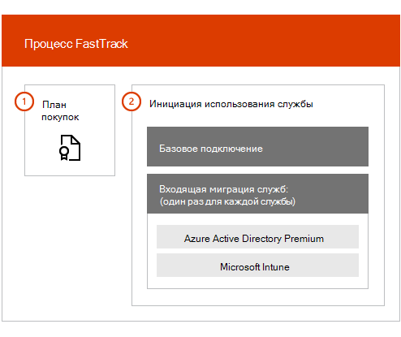

# Обзор преимущества FastTrack CenterFastTrack Center Benefit Overview

Если вы используете преимущество FastTrack Center для Microsoft Azure Active Directory Premium, Microsoft Intune и Azure Information Protection, специалисты FastTrack удаленно подготовят вашу среду к использованию, а также спланируют ее развертывание и использование в организации.With FastTrack Center Benefit for Microsoft Azure Active Directory Premium, Microsoft Intune, and Azure Information Protection, you work remotely with FastTrack Specialists to get your environment ready for use and to plan the rollout and usage within your organization. Дополнительные сведения о доступности см. в статье [Процесс реализации преимущества FastTrack Center для Enterprise Mobility + Security (EMS)](EMS-fasttrack-process.md).To learn more about eligibility, see [FastTrack Center Benefit Process for Enterprise Mobility + Security (EMS)](EMS-fasttrack-process.md).

Процесс входящей миграции состоит из двух основных этапов:Onboarding has two major components:

-   **Базовая входящая миграция** — задачи, необходимые для настройки клиентов и (при необходимости) интеграции с Azure Active Directory.**Core onboarding** - Tasks required for tenant configuration and integration with Azure Active Directory, if needed. Кроме того, базовая входящая миграция создает основу для входящей миграции других доступных вам служб Microsoft Online.Core onboarding also provides the baseline for onboarding other Microsoft Online eligible services.

-   **Входящая миграция служб** — задачи, необходимые для настройки любого отдельного варианта рабочей нагрузки EMS (Azure AD Premium, Intune и Azure Information Protection).**Service onboarding** - Tasks required to configure any of the standalone variants of the EMS workload (Azure AD Premium, Intune, and Azure Information Protection).

На следующей схеме представлены этапы входящей миграции на высоком уровне для преимущества FastTrack Center.The following diagram describes the high-level onboarding phases for the the FastTrack Center Benefit.

Принципы выполнения процесса:Here's how the process works:

- Центр FastTrack пытается связаться с вами, чтобы предложить помощь по входящей миграцией после приобретения лицензий на соответствующую службу.The FastTrack Center tries to contact you to offer onboarding assistance after you purchase licenses of an eligible service. Также можно запросить помощь в [Центре FastTrack](https://go.microsoft.com/fwlink/?linkid=780698), если вы готовы развернуть эти службы для своей организации.You can also request assistance from the [FastTrack Center](https://go.microsoft.com/fwlink/?linkid=780698) if you're ready to deploy these services for your organization. Чтобы запросить помощь, войдите в [Центр FastTrack](https://go.microsoft.com/fwlink/?linkid=780698) с помощью рабочей или учебной учетной записи, перейдите на информационную панель, щелкните ссылку **Требуется помощь?** в правом нижнем углу страницы и следуйте инструкциям для выполнения запроса.To request assistance, sign in to the [FastTrack Center](https://go.microsoft.com/fwlink/?linkid=780698) with your work or school account, go to the dashboard, expand the **Need Help?** link at the lower-right corner of the page, and then follow the prompts to complete your request. После начала входящей миграции мы составим расписание собраний по сети.Once onboarding starts, we’ll set up a schedule of online meetings.

-   Команда FastTrack сначала поможет вам с основными функциями (общие для всех служб Microsoft Online), а затем с входящей миграцией каждой соответствующей службы.The FastTrack team helps you first with core capabilities (common for all Microsoft Online Services) and then with onboarding each eligible service.

Все рекомендации по входящей миграции предоставляются удаленно назначенными сотрудниками FastTrack:All onboarding guidance is provided remotely by assigned FastTrack personnel:

-   Команда FastTrack окажет вам удаленную поддержку по различным действиям миграции с помощью сочетания инструментов, документации и инструкций.The FastTrack team remotely assists you with various onboarding activities by using a combination of tools, documentation, and guidance.

-   Инструкции по входящей миграции предоставляет Центр FastTrack, и они доступны в обычное рабочее время для соответствующего региона.Onboarding guidance is provided by the FastTrack Center, and is available during normal business hours for a given region.

-   Помощь по входящей миграции доступна на английском, вьетнамском, испанском, итальянском, китайском (традиционное письмо), китайском (упрощенное письмо) (сотрудники разговаривают только на мандаринском диалекте китайского языка), корейском, немецком, португальском (Бразилия), тайском, французском и японском языках.Onboarding assistance is available in Traditional Chinese, Simplified Chinese (resources speak Mandarin only), English, French, German, Italian, Japanese, Korean, Portuguese (Brazil), Spanish, Thai, and Vietnamese.

-   Команда FastTrack может работать непосредственно с вами или вашим представителем.The FastTrack team can work directly with you or your representative.

> [!NOTE]
> **Хотите узнать больше?** См. статью [Enterprise Mobility + Security](https://www.microsoft.com/cloud-platform/enterprise-mobility).**Want to learn more?** see [Enterprise Mobility + Security](https://www.microsoft.com/cloud-platform/enterprise-mobility).

## Дальнейшие действияNext steps

[Преимущество FastTrack Center для EMS — требования к исходной средеFastTrack Center benefit for EMS - Source environment expectations](EMS-source-environment-expectations.md)
