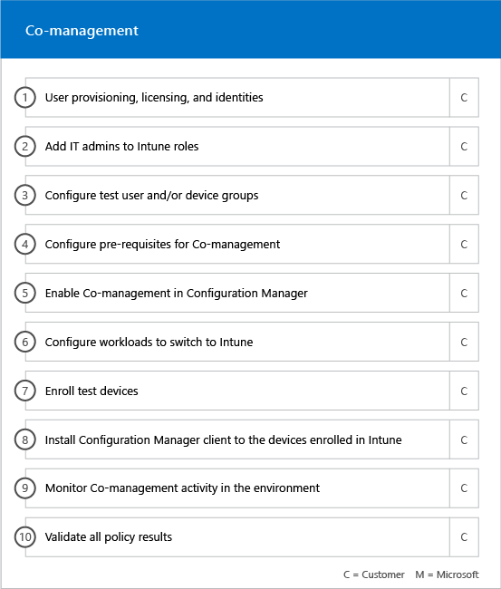

# Этапы подключения

При использовании подХодящих [служб и планов](M365-eligible-services-and-plans.md) для получения Microsoft Azure Active Directory Premium и готовности Microsoft Intune к использованию в процесс включается несколько этапов. В следующих разделах описывается каждый этап процесса входящей миграции.

Входящая миграция состоит из четырех основных этапов:

## Начальная фаза

После приобретения соответствующего количества лицензий следуйте указаниям из сообщения с подтверждением покупки, чтобы связать лицензии с существующим клиентом или новым клиентом. Корпорация Майкрософт проверяет права на использование центра FastTrack и пытается связаться с вами, чтобы предоставить помощь по входящей миграции.

> [!NOTE]
> Вы также можете запросить помощь из [центра FastTrack](https://go.microsoft.com/fwlink/?linkid=780698) , если вы готовы развернуть эти службы для своей организации.

### Чтобы запросить помощь

1. Войдите на [сайт FastTrack](https://go.microsoft.com/fwlink/?linkid=780698).
2. Выберите **FastTrack**.
3. Выберите **Услуги**.
4. ЗаПолните **запрос для помощи в форме Microsoft 365**.

Когда начнется поддержка входящей миграции, мы настроим расписание собраний по сети.

> [!NOTE]
> Если у вас есть партнер Майкрософт, указанный в вашем клиенте Office 365, этот параметр не отображается. Обратитесь за помощью к своему партнеру Майкрософт.

Партнеры корпорации Майкрософт также могут получить помощь через [сайт FastTrack](https://go.microsoft.com/fwlink/?linkid=780698) от имени клиента. To do so:

1. Войдите на [сайт FastTrack](https://go.microsoft.com/fwlink/?linkid=780698).
2. Выберите **FastTrack**.
3. Выберите **Мои пользователи**.
4. Найдите своего пользователя или выберите его в списке пользователей.
5. Выберите **Услуги**.
6. ЗаПолните **запрос для помощи в форме Microsoft 365**.

Когда начнется поддержка входящей миграции, FastTrack настроит расписание собраний по сети, чтобы обсудить процесс входящей миграции, проверить данные и настроить начало собрания.

## Фаза оценки

После начала процесса входящей миграции центр FastTrack будет работать с вами для оценки исходной среды и требований. Средства запускаются для оценки среды, и специалисты FastTrack помогут вам оценить вашу локальную службу Active Directory, Интернет-браузеры, операционные системы устройств, операционные системы, службу доменных имен (DNS), сеть, инфраструктуру и систему идентификации. Определите, требуются ли какие – либо изменения для входящей миграции.

FastTrack Center также подключается к вам и рекомендациям по успешному внедрению соответствующих служб.

В соответствии с текущей настройкой мы предоставляем план исправления, который переводит исходную среду к минимальным требованиям для успешной входящей миграции на службу EMS или ее отдельных облачных службах. Мы также настроили соответствующие вызовы контрольной точки на этапе исправления.

## Фаза исправления
Вы выполняете задачи в плане по исправлению в исходной среде, чтобы обеспечить соответствие требованиям для входящей миграции и адаптации каждой службы (при необходимости).

Перед началом этапа включения мы совместно проверим результаты действий по устранению неполадок, чтобы убедиться, что вы готовы продолжить.

## Фаза включения
После выполнения всех действий по устранению неполадок проект переходит к настройке основной инфраструктуры для использования служб и подготовке каждой соответствующей облачной службы EMS.

**Основные возможности включения фазы**

Базовая входящая миграция включает в себя подготовку служб и интеграцию клиентов и удостоверений. Кроме того, он содержит инструкции по предоставлению фундамента для встроенных онлайн-служб, таких как Azure AD Premium и Intune.

> [!NOTE]
> WAP означает "прокси-служба веб-приложения" (Web Application Proxy). SSL означает Secure Sockets Layer. SDS означает School Data Sync. Дополнительные сведения о Microsoft School Data Sync см. в [этой статье](https://go.microsoft.com/fwlink/?linkid=871480).

> [!NOTE]
> Управляемый метод проверки подлинности включает, но не ограничивается синхронизацией хэша паролей. Интеграция удостоверений это одно действие, которое не включает перенос или списание существующих методов проверки подлинности, например управляемых или федеративных.

### Фаза включения — Azure AD Premium

Среду Azure AD Premium можно настроить с помощью синхронизации каталогов средств Azure Active Directory Connect и служб федерации Active Directory (AD FS) (при необходимости).

Для сценариев Azure AD Premium, которые включают в себя синхронизацию локальных удостоверений с облаком, мы поможем вам добавить ИТ — администраторов и пользователей в подписку, настроить необходимые компоненты управления, настроить службу Azure AD Premium, настроить каталог. синхронизацию с управляемой проверкой подлинности и AD FS с помощью средства Azure AD Connect, настройки тестовых пользователей и проверки основных вариантов использования службы.

Программа установки Azure AD Premium включает следующие функции:

-   Восстановление пароля самоОбслуживания Azure Active Directory (SSPR).

-   МногоФакторная проверка поДлинности Azure (Azure MFA).

-   До трех (3) или более программного обеспечения для интеграции приложений (SaaS) с единым входом (SSO) из службы [Azure Active Directory Marketplace](https://azure.microsoft.com/marketplace/active-directory/).

-   Автоматическая подготовка пользователей для предварительно интегрированных приложений SaaS, перечисленных в [списке учебник по интеграции приложений](https://docs.microsoft.com/en-us/azure/active-directory/saas-apps/tutorial-list), только для подготовки исходящей почты.

-   Настраиваемый экран входа в систему, включая логотип, текст и изображения.

-   Самостоятельная служба и динамические группы (группы).

-   Прокси-сервер приложения Azure Active Directory.

-   Работоспособность подключения Azure Active Directory.

-   Условный доступ к Azure Active Directory.

-   Условия использования Azure Active Directory.

-   Защита удостоверений Azure Active Directory.

-   Azure Active Directory: привилегированное управление удостоверениями.

-   Проверка доступа Azure Active Directory.

### Фаза включения — Intune

Для Intune мы поможем вам приступить к работе с Microsoft Intune для управления устройствами. Конкретные действия зависят от исходной среды и основаны на мобильном устройстве и управлении мобильными приложениями. Возможные действия:

-   Лицензирование конечных пользователей. Кроме того, мы предоставляем помощь по активации корпоративных лицензий для вашего клиента облачной службы Майкрософт (при необходимости).

-   Настройка удостоверений для использования в Intune путем использования локальных удостоверений Active Directory или облачных удостоверений.

-   Добавление пользователей в подписку Intune, определение ролей ИТ, а также создание групп пользователей и устройств.

-   Настройка центра управления мобильными устройствами (MDM) в соответствии с потребностями управления, в том числе:

    -   Настройка Intune в качестве администратора MDM, когда Intune это единственное решение MDM или используется совместно с управлением мобильными устройствами для Office 365.

-   Предоставление рекомендаций по MDM для:

    -   Настройка тестовых групп, которые будут использоваться для проверки политик управления MDM.

    -   Настройка политик управления MDM и таких служб, как:

        -   Развертывание приложений для каждой поддерживаемой платформы через веб-ссылки или глубокие ссылки.

        -   Политики условного доступа.

        -   Развертывание профилей электронной почты, беспроводных сетей и профилей виртуальной частной сети (VPN), если у вас уже есть центр сертификации, сеть Wi-Fi или VPN в Организации.

        -   Настройка Microsoft Intune Exchange Connector (при необходимости).

        -   Подключение к хранилищу данных Intune

        -   Интеграция Intune с:
            -   Средство просмотра Team Viewer для удаленного помощника (необходимо подписку на Team Viewer).

            -   Партнерское решение по защите от угроз (МТД) (защита от угроз для мобильных устройств) является обязательным).

            -   Решение по управлению расходами на связи (необходимо указать подписку на решение для управления расходами на связи).

            -   Advanced Threat Protection в Защитнике Windows (требуются лицензии Windows или Microsoft 365 для вододействия).

    -   Регистрация устройств каждой поддерживаемой [платформы](https://technet.microsoft.com/library/dn600287.aspx) в Intune.

-   Рекомендации по обеспечению защиты приложений:

    -   Настройка политик защиты приложений для каждой поддерживаемой платформы.

    -   Настройка политик условного доступа для управляемых приложений.

    -   НаЦеливание соответствующих групп пользователей с помощью указанных выше политик MAM.

    -   Использование отчетов об использовании управляемых приложений.

-   Рекомендации по управлению компьютером:

    -   Установка клиентского программного обеспечения Intune (при необходимости).

    -   Использование отчетов по программному обеспечению и оборудованию, доступных в Intune.

    > [!IMPORTANT]
    > FastTrack не поддерживает управление классическими компьютерами с Windows 10 с помощью Intune. FastTrack поддерживает только управление устройствами Windows 10 через Управление мобильными устройствами Intune (MDM).

#### Windows Autopilot

FastTrack поможет упростить подготовку устройства с помощью Windows для автопилота и Intune, предоставляя конечным пользователям новые устройства без необходимости создавать, поддерживать и применять образы операционной системы к вашим устройствам.

FastTrack поддерживает следующие сценарии для автопилота:

- **Самостоятельная служба Azure AD:** Устройства присоединяются к Azure AD и регистрируются в Intune. Этот сценарий поддерживается при использовании Windows 10 1703 и более поздних версий.

- **Гибридная самослужба AAD:** Устройства присоединяются к локальной службе AD и Azure AD и регистрируются в Intune. Этот сценарий поддерживается при использовании Windows 10 1809 и более поздних версий.

- **Самостоятельная подготовка:** Устройства автоматически присоединяются к Azure AD. Этот сценарий поддерживается при использовании Windows 1809 и более поздних версий.

    > [!IMPORTANT]
    > FastTrack не поддерживает сценарии автопилота, инициированные из Configuration Manager.

Действия, необходимые для настройки автопилота Windows, зависят от исходной среды и могут включать:

- Настройка и настройка Microsoft Intune для Windows "Автопилот".

- Настройка динамических групп Azure AD

- Добавьте фирменную символику компании в Azure AD.

- Создайте и назначьте устройства для профилей Windows в режиме автопилота (например, профиль Windows автопилота, который запрещает создание учетной записи локального администратора).

- Настройка готового к работе (OOBE) в соответствии с требованиями Организации.

- Настройка автоматической регистрации MDM в Azure AD и Intune.

#### Безопасная установка Outlook для iOS и Android

С помощью FastTrack можно безопасно развернуть Outlook для iOS и Android в Организации, чтобы убедиться, что все необходимые приложения установлены для всех пользователей.

Действия, необходимые для безопасного развертывания Outlook Mobile для iOS и Android с помощью Intune, зависят от исходной среды и могут включать:

- Скачайте Outlook для iOS и Android, средство проверки поДлинности Майкрософт и приложение корпоративного портала Intune через магазин приложений Apple или Google Воспр Store.
- Кроме того, предоставьте рекомендации по настройке:
    - Outlook для iOS и Android, средство проверки поДлинности Майкрософт и развертывание приложения корпоративного портала Intune с Intune.
    - Политики защиты приложений
    - Политики условного доступа
    - Политики настройки приложений

    > [!IMPORTANT]
    > Команда FastTrack не поддерживает защиту Outlook для iOS и Android с политиками почтовых ящиков мобильных устройств Exchange.

#### Совместное управление

FastTrack поможет вам подготовиться к параллельному управлению устройствами с Windows 10 с помощью Configuration Manager и Intune. Конкретные действия зависят от исходной среды и могут включать:

- Объясните преимущества совместного управления.

- Лицензирование конечных пользователей. FastTrack также предоставляет помощь по активации корпоративных лицензий для клиента облачной службы Майкрософт (при необходимости).

- Настройте удостоверения, которые будут использоваться Intune, используя локальные и/или облачные удостоверения Active Directory.

- Добавление пользователей в подписку Intune, определение ролей ИТ, а также создание групп пользователей и устройств.

- Предоставление указания по переходу с Intune на интеграцию с System Center Configuration Manager (гибридная среда) к Intune в автономном режиме.

- Предоставление рекомендаций по настройке Azure Active Directory для автоматической регистрации MDM.

- Предоставление рекомендаций по настройке гибридного подключения Azure Active Directory.

- Предоставление рекомендаций по настройке облачного шлюза управления

- Включение функции совместного управления в консоли Configuration Manager.

- Настройте поддерживаемые рабочие нагрузки, которые необходимо переключиться в Intune.

- Установите клиент Configuration Manager на зарегистрированных устройствах Intune.

- Предоставление рекомендаций по мониторингу действий совместного управления в вашей среде.

FastTrack также предоставляет инструкции по успешному внедрению соответствующих служб.

> [!NOTE]
> **Хотите узнать больше?** Ознакомьтесь с разрешениями [Enterprise Mobility + Security](https://www.microsoft.com/en-us/cloud-platform/enterprise-mobility).

## Дальнейшие действия

[Преимущества FastTrack для ответственности в СЛУЖБах EMS (Майкрософт)](EMS-fasttrack-responsibilities.md)
