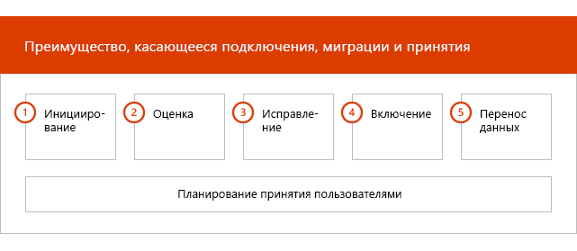

# Этапы подключения

Если вы используете [поддерживаемые службы и планы](M365-eligible-services-and-plans.md) для подготовки к использованию Microsoft Azure Active Directory Premium, Microsoft Intune и Azure Information Protection, этот процесс включает несколько этапов. В следующих разделах описаны все этапы процесса подключения.

Подключение состоит из четырех основных этапов:

## Начальный этап

После приобретения необходимого количества лицензий следуйте указаниям из сообщения о подтверждении покупки, чтобы связать лицензии с имеющимся или новым клиентом. После этого корпорация Майкрософт проверяет ваше право на использование преимущества FastTrack Center и пытается связаться с вами, чтобы предложить помощь по подключению.

> [!NOTE]
> Также можно запросить помощь на [сайте FastTrack](https://go.microsoft.com/fwlink/?linkid=780698), если вы готовы развернуть эти службы для своей организации.

### Чтобы запросить помощь

1. Войдите на [сайт FastTrack](https://go.microsoft.com/fwlink/?linkid=780698).
2. Выберите **Запросить помощь для Microsoft 365** из **быстрых действий** в верхней части начальной страницы или выберите **Запросить помощь для Microsoft 365** на карточке развертывания.
3. Заполните форму **Запросить помощь с Microsoft 365**.

Когда начнется поддержка входящей миграции, мы составим расписание собраний по сети.

Партнеры корпорации Майкрософт могут также получить помощь через [сайт FastTrack](https://go.microsoft.com/fwlink/?linkid=780698) от имени клиента. Для этого:

1. Войдите на [сайт FastTrack](https://go.microsoft.com/fwlink/?linkid=780698).
2. Выберите **Мои пользователи**.
3. Найдите своего пользователя или выберите его в списке пользователей.
4. Выберите **Сервисы**.
5. Заполните форму **Запросить помощь с Microsoft 365**.

После запуска поддержки подключения специалисты FastTrack настроят для вас расписание собраний по сети, чтобы обсудить процесс подключения, проверить данные и подготовить установочное собрание.

## Этап оценки

После начала процесса подключения сотрудники Центра FastTrack помогут вам оценить исходную среду и требования к ней. Запускаются средства для оценки вашей среды, и специалисты FastTrack помогут вам оценить локальные службы Active Directory, интернет-браузеры, операционные системы клиентских устройств, службу доменных имен (DNS), сеть, инфраструктуру и систему идентификации, чтобы определить, нужны ли изменения перед подключением.

Кроме того, сотрудники Центра FastTrack предоставят вам всю необходимую информацию для успешного внедрения поддерживаемых служб.

На основе вашей текущей конфигурации мы составим план, который обеспечит соответствие исходной среды минимальным требованиям для успешного подключения к EMS или отдельным облачным службам. Кроме того, мы назначим звонки по ключевым этапам фазы устранения ошибок.

## Этап устранения ошибок
Вам нужно выполнить задачи из плана устранения ошибок исходной среды, чтобы обеспечить соответствие требованиям подключения и адаптации каждой службы (при необходимости).

Перед началом этапа включения мы совместно с вами проверим результаты действий по устранению ошибок и убедимся, что вы готовы продолжить работу.

## Этап включения
После выполнения всех задач по устранению ошибок проект переходит к этапу настройки базовой инфраструктуры использования сервисов и подготовки всех поддерживаемых облачных служб EMS.

**Этап включения — базовые возможности**

Базовое подключение подразумевает подготовку служб к работе и интеграцию клиентов и удостоверений. Кроме того, сюда относятся действия по созданию основы для подключения онлайн-служб, таких как Azure AD Premium, Intune и Azure Information Protection.

> [!NOTE]
> WAP означает "прокси-служба веб-приложения" (Web Application Proxy). SSL означает Secure Sockets Layer. SDS означает School Data Sync. Дополнительные сведения о Microsoft School Data Sync см. в [этой статье](https://go.microsoft.com/fwlink/?linkid=871480).

> [!NOTE]
> Управляемый метод проверки подлинности включает, но не ограничивается синхронизацией хэша паролей. Интеграция удостоверений — это однократное действие, не включающее перенос или отключение существующих методов проверки подлинности, например управляемых или федеративных.

### Этап включения — Azure AD Premium

Среду Azure AD Premium можно настроить с помощью синхронизации каталогов средства Azure Active Directory Connect и служб федерации Active Directory (AD FS) (при необходимости).

Для сценариев Azure AD Premium, включающих синхронизацию локальных удостоверений с облаком, мы поможем вам добавить ИТ-администраторов и пользователей в подписку, настроить необходимые компоненты управления, настроить Azure AD Premium, настроить синхронизацию каталога с управляемой проверкой подлинности и AD FS с помощью средства Azure AD Connect, настроить тестовых пользователей и проверить основные варианты использования службы.

Настройка Azure AD Premium обеспечивает включение следующих функций:

-   Самостоятельный сброс пароля (SSPR) Azure Active Directory.

-   Многофакторная проверка подлинности Azure (Azure MFA).

-   Интеграция до трех (3) или более приложений в виде услуги (SaaS) с единым входом из [Azure Active Directory Marketplace](https://azure.microsoft.com/marketplace/active-directory/).

-   Автоматическая подготовка пользователей для предварительно интегрированных приложений SaaS, перечисленных в [списке руководства по интеграции приложений](https://docs.microsoft.com/azure/active-directory/saas-apps/tutorial-list), ограниченных только исходящей подготовкой.

-   Настраиваемый экран входа в систему, включая логотип, текст и изображения.

-   Группы самообслуживания и динамические группы (группы).

-   Azure Active Directory Application Proxy.

-   Azure Active Directory Connect Health.

-   Условный доступ в Azure Active Directory.

-   Условия использования Azure Active Directory.

-   Защита идентификации Azure Active Directory.

-   Azure Active Directory Privileged Identity Management.

-   Проверки доступа Azure Active Directory.

-   Защита пароля Azure Active Directory.

-   Azure Active Directory B2B.

### Этап включения — Intune

Для Intune мы поможем вам подготовиться к использованию Microsoft Intune с целью управления устройствами. Конкретные действия зависят от исходной среды и основаны на мобильном устройстве и требованиях к управлению мобильными приложениями. Возможные действия:

-   Лицензирование конечных пользователей. Кроме того, мы поможем вам активировать корпоративные лицензии для клиента облачной службы Майкрософт (при необходимости).

-   Настройка удостоверений, применяемых в Intune с помощью локальной службы Active Directory или облачных удостоверений.

-   Добавление пользователей в подписку Intune, определение ролей ИТ-администраторов, а также создание групп пользователей и устройств.

-   Настройка центра управления мобильными устройствами (MDM) в соответствии с потребностями управления, в том числе:

    -   Настройка Intune в качестве центра MDM, когда Intune является единственным решением MDM.

-   Предоставление рекомендаций по MDM для следующих действий:

    -   Настройка тестовых групп, используемых для проверки политик управления MDM.

    -   Настройка политик управления MDM и таких служб, как:

        -   Развертывание приложений для каждой поддерживаемой платформы с помощью веб-ссылок или прямых ссылок.

        -   Политики условного доступа.

        -   Развертывание электронной почты, беспроводных сетей и профилей виртуальных частных сетей (VPN), если в вашей организации есть центр сертификации, сеть Wi-Fi или VPN.

        -   Настройка соединителя Microsoft Intune с Exchange (при необходимости).

        -   Подключение к хранилищу данных Intune.

        -   Интеграция Intune со следующими компонентами:
            -   Team Viewer для удаленной помощи (необходима подписка на Team Viewer).

            -   Решения партнера Mobile Threat Defense (MTD) (требуется подписка на Mobile Threat Defense).

            -   Решение для управления затратами на телекоммуникации (требуется подписка на решение для управления затратами на телекоммуникации).

            -   Advanced Threat Protection в Microsoft Defender (требуется лицензия Windows E5 или Microsoft 365 E5).

    -   Регистрация устройств всех [поддерживаемых платформ](https://technet.microsoft.com/library/dn600287.aspx) в Intune.

-   Предоставление рекомендаций по защите приложений:

    -   Настройка политик защиты приложений для каждой поддерживаемой платформы.

    -   Настройка политик условного доступа для управляемых приложений.

    -   Выбор соответствующих целевых групп пользователей с помощью указанных выше политик MAM.

    -   Использование отчетов о применении управляемых приложений.

-   Предоставление рекомендаций по управлению компьютером:

    -   Установка программного обеспечения клиента Intune (при необходимости).

    -   Использование отчетов по программному обеспечению и оборудованию, доступных в Intune.

    > [!IMPORTANT]
    > FastTrack не поддерживает классическое управление компьютером с Windows 10 при помощи Intune. FastTrack поддерживает управление устройствами с Windows 10 только с помощью службы управления мобильными устройствами (MDM) Intune.

#### Windows Autopilot

FastTrack помогает упростить подготовку устройства с помощью Windows Autopilot и Intune, предоставляя конечным пользователям новые устройства без необходимости создания, обслуживания и применения настраиваемых образов операционной системы к вашим устройствам.

FastTrack поддерживает следующие сценарии Autopilot:

- **Самостоятельное обслуживание в Azure AD:** устройства присоединяются к Azure AD и регистрируются в Intune. Этот сценарий поддерживается в Windows 10 версии 1703 и более поздних.

- **Самостоятельное обслуживание в гибридной службе AAD:** устройства присоединяются к локальной службе AD, а также к Azure AD и регистрируются в Intune. Этот сценарий поддерживается в Windows 10 версии 1809 и более поздних.

- **Самостоятельная подготовка:** устройства автоматически присоединяются к Azure AD. Этот сценарий поддерживается в Windows версии 1809 и более поздних.

    > [!IMPORTANT]
    > FastTrack не поддерживает сценарии Autopilot, запускаемые в Configuration Manager.

Действия, необходимые для настройки Windows Autopilot, зависят от исходной среды и могут включать следующее:

- Конфигурация и настройка Microsoft Intune для Windows Autopilot.

- Настройка динамических групп Azure AD

- Добавление фирменной символики компании в Azure AD.

- Создание и назначение устройств для профилей Windows Autopilot (например, для профиля Windows Autopilot, запрещающего создание учетной записи локального администратора).

- Настройка интерфейса, запускаемого при первом включении (OOBE), в соответствии с требованиями организации.

- Настройка автоматической регистрации MDM в Azure AD и Intune.

#### Безопасное развертывание Outlook для iOS и Android

С помощью FastTrack можно безопасно развернуть Outlook для iOS и Android в организации, чтобы обеспечить установку всех необходимых приложений для пользователей.

Действия, необходимые для безопасного развертывания Outlook Mobile для iOS и Android с помощью Intune, зависят от исходной среды и могут включать следующее:

- Скачивание Outlook для iOS и Android, Microsoft Authenticator и приложения корпоративного портала Intune в магазине Apple App Store или Google Play Store.
- Также предоставляются рекомендации по настройке следующих компонентов:
    - Развертывание Outlook для iOS и Android, Microsoft Authenticator и приложения портала компании Intune с помощью Intune.
    - Политики защиты приложений
    - Политики условного доступа
    - Политики конфигурации приложений

    > [!IMPORTANT]
    > Команда FastTrack не поддерживает защиту Outlook для iOS и Android с помощью политик почтовых ящиков мобильных устройств Exchange.

#### Подключение к облаку

FastTrack предоставляет руководство по подготовке к облачному подключению существующих сред диспетчера конфигураций с помощью Intune. Конкретные действия зависят от исходной среды. Возможные действия:

- Объяснение преимуществ облачного подключения диспетчера конфигураций с помощью Intune.

- Лицензирование конечных пользователей. Кроме того, специалисты FastTrack помогут вам активировать корпоративные лицензии для клиента облачной службы Майкрософт (при необходимости).

- Настройка удостоверений, применяемых в Intune с помощью локальной службы Active Directory и облачных удостоверений.

- Добавление пользователей в подписку Intune, определение ролей ИТ-администраторов, а также создание групп пользователей и устройств.

- Включение подключения к облаку в консоли диспетчера конфигураций.

- Предоставление рекомендаций по настройке гибридного подключения Azure Active Directory.

- Предоставление рекомендаций по настройке Azure Active Directory для автоматической регистрации MDM.

- Предоставление рекомендаций по настройке шлюза управления облачными клиентами.

- Настройка поддерживаемых рабочих нагрузок, которые нужно перевести в Intune.

- Установка клиента диспетчера конфигураций на устройствах, зарегистрированных в Intune.

Кроме того, специалисты FastTrack предоставляют инструкции по успешному внедрению поддерживаемых служб.

 

#### Этап включения — Azure Information Protection

Пользователям предоставляются рекомендации по следующим действиям: 

- Активация и настройка клиента.
- Создание и настройка меток и политик.
- Применение защиты данных к документам. 
- Автоматическая классификация и пометка сведений в приложениях Office (например, Word, PowerPoint, Excel и Outlook), работающих в Windows и использующих клиент Azure Information Protection.
- Использование неактивных файлов с помощью сканера Azure Information Protection.
- Отслеживание сообщений электронной почты в пути с помощью правил потока обработки почты Exchange Online.

Поддержка также предоставляется пользователям, которые хотят применять защиту с помощью служб Microsoft Azure Rights Management (Azure RMS), шифрования сообщений Office 365 (OME) и защиты от потери данных (DLP).

> [!NOTE]
> **Хотите узнать больше?** См. статью [Enterprise Mobility + Security](https://www.microsoft.com/cloud-platform/enterprise-mobility).

## Дальнейшие действия

[Преимущество FastTrack для EMS — обязанности корпорации Майкрософт](EMS-fasttrack-responsibilities.md)

