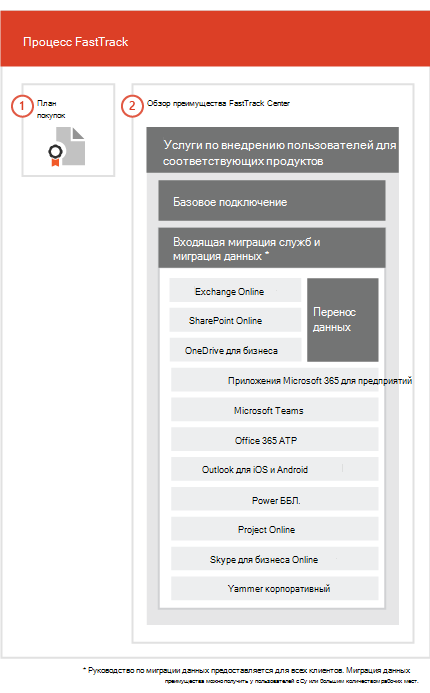

# Процесс FastTrackThe FastTrack Process

> [!CAUTION]
> Это содержимое неактуально, и поэтому запланировано его удаление.This content is no longer current and is scheduled for removal. Используйте содержание на левой панели навигации, чтобы получить актуальное содержимое.Use the table of contents in the left-hand navigation for current content.

Процесс FastTrack предоставляет услуги по подключению и популяризации продукта среди пользователей.The FastTrack process provides onboarding and user adoption services. 
  
Входящая миграция состоит из указанных ниже частей.Onboarding consists of:
  
- *Базовая подключение* — это задачи, необходимые для настройки клиентов и (при необходимости) интеграции с Azure Active Directory. Кроме того, базовое подключение создает основу для подключения других подходящих служб.*Core onboarding* — These are tasks required for tenant configuration and integration with Azure Active Directory (Azure AD) if needed. Core onboarding also provides the baseline for onboarding other eligible services. 
- *Подключение и миграция служб* — задачи подключения служб позволяют реализовывать сценарии в клиенте. Перенос данных (в том числе электронной почты и файлов) рассматривается в разделе [Перенос данных](O365-data-migration.md).*Service onboarding and migration* — Service onboarding tasks enable scenarios in your tenant. Data migration (including email and files) is covered in [Data Migration](O365-data-migration.md). 
    
Услуги по обеспечению принятия продукта пользователями включают задачи с инструкциями по уведомлению пользователей о доступных им службах и о том, как использовать эти службы для повышения эффективности работы. Такая помощь оказывается одновременно с мероприятиями по входящей миграции.User adoption services are comprised of tasks that provide guidance for you to ensure your users are aware of the eligible services and can use them to drive business value. This assistance occurs in parallel to onboarding activities.
  
> [!NOTE]
> Специалисты FastTrack предоставляют пользователям рекомендации и советы для достижения быстрых и предсказуемых результатов. Если вы выполните развертывание без учета этих рекомендаций, это может сказаться на эффективности подключения и удобстве использования службы. Руководство включает в себя как устные, так и письменные инструкции. Когда специалисты FastTrack предоставляют руководство, они не могут действовать от вашего имени. Пока ваша подписка активна, вы можете с помощью FastTrack подключить любой продукт, соответствующий критериям, и обеспечить его принятие.FastTrack provides customers with a recommended approach, guidance, and best practices engineered to deliver quick and predictable outcomes. If you choose to deploy outside of this guidance, your onboarding experience and usage of the service may be impacted. Guidance is defined as a combination of verbal and written assistance. When FastTrack Specialists provide guidance, FastTrack personnel cannot act on your behalf. You can use FastTrack services to onboard and adopt any qualifying product workload as long as your subscription is current. 
  
## Процесс входящей миграцииThe onboarding process

На приведенной ниже схеме представлен процесс подключения.The following diagram illustrates the onboarding process.
  

  
Вы можете получить помощь через [Центр администрирования Microsoft 365](https://go.microsoft.com/fwlink/?linkid=2032704) или [сайт FastTrack](https://go.microsoft.com/fwlink/?linkid=780698).You can get help through the [Microsoft 365 admin center](https://go.microsoft.com/fwlink/?linkid=2032704) or the [FastTrack site](https://go.microsoft.com/fwlink/?linkid=780698). 

Чтобы получить помощь через [Центр администрирования Microsoft 365](https://go.microsoft.com/fwlink/?linkid=2032704), администратор должен щелкнуть мини-приложение **Нужна помощь?**, войдя в этот центр.To get help through the [Microsoft 365 admin center](https://go.microsoft.com/fwlink/?linkid=2032704), your admin signs into the admin center and then clicks the **Need help?** widget. 

Чтобы получить помощь через [сайт FastTrack](https://go.microsoft.com/fwlink/?linkid=780698):To get help through the [FastTrack site](https://go.microsoft.com/fwlink/?linkid=780698): 
1.    Войдите на [сайт FastTrack](https://go.microsoft.com/fwlink/?linkid=780698).Sign in to the [FastTrack site](https://go.microsoft.com/fwlink/?linkid=780698). 
2.    Выберите **Запросить помощь для Microsoft 365** из **быстрых действий** в верхней части начальной страницы.Select **Request assistance with Microsoft 365** from the **quick actions** on the top of your landing page.
3.    Заполните форму **Запросить помощь с Microsoft 365**.Complete the **Request Assistance with Microsoft 365** form.
  
Партнеры могут также получить помощь через [сайт FastTrack](https://go.microsoft.com/fwlink/?linkid=780698) от лица клиента. Для этого:Partners can also get help through the [FastTrack site](https://go.microsoft.com/fwlink/?linkid=780698) on behalf of a customer. To do so:
1.    Войдите на [сайт FastTrack](https://go.microsoft.com/fwlink/?linkid=780698).Sign in to the [FastTrack site](https://go.microsoft.com/fwlink/?linkid=780698). 
2.    Выберите **Запросить помощь для Microsoft 365** из **быстрых действий** в верхней части начальной страницы.Select **Request assistance with Microsoft 365** from the **quick actions** on the top of your landing page.
3.    Найдите своего клиента, указав имя клиента, домен или TPID.Search for your customer by entering the customer name, domain, or TPID.
4.    Выберите клиента в результатах поиска.Select customer from the search results.
5.    Заполните форму **Запросить помощь с Microsoft 365**.Complete the **Request Assistance with Microsoft 365** form.
  
 Вы также можете запросить помощь FastTrack Center на [сайте FastTrack](https://go.microsoft.com/fwlink/?linkid=780698), открыв список доступных услуг для своего клиента.You can also ask for FastTrack Center help from the [FastTrack site](https://go.microsoft.com/fwlink/?linkid=780698) in the list of available services for your tenant. 
    
 Когда начнется поддержка подключения, мы составим расписание собраний по сети.Once onboarding assistance starts, we set up a schedule of online meetings.

В приведенной ниже таблице перечислены роли и обязанности, связанные с процессом FastTrack.The following table lists roles and responsibilities for the process.
    
|||
|:-----|:-----|
|**Роль****Role**   |**Обязанности****Responsibility**   |
|**Специалист FastTrack****FastTrack Specialist**   |В удаленном режиме предоставляет необходимую помощь по обеспечению подключения, миграции, а также адаптации пользователей.Provides all onboarding, migration, and user adoption services remotely.    Оказывает удаленную поддержку с помощью инструментов и опубликованной документации.Assists you remotely by using a combination of tools and published documentation.   Работает непосредственно с вами или вашим представителем.Works directly with you or your representative.   Предоставляет инструкции по переносу электронной почты и данных.Provides email and data migration guidance.|
|**FastTrack Center****FastTrack Center**    |Предоставляет инструкции по выполнению базового подключения и подключения служб, а также по планированию успешной адаптации пользователей служб, соответствующих критериям.Provides guidance with core and service onboarding and planning successful adoption of eligible services.    Осуществляет поддержку и доступен в обычное рабочее время для соответствующего региона.Provides assistance and is available during normal business hours for a given region.   Предоставляет поддержку на английском, вьетнамском, испанском, итальянском, китайском (традиционное письмо), китайском (упрощенное письмо) (сотрудники разговаривают только на мандаринском диалекте китайского языка), корейском, немецком, португальском (Бразилия), тайском, французском и японском языках.Provides assistance in Traditional Chinese and Simplified Chinese (resources speak Mandarin only), English, French, German, Italian, Japanese, Korean, Portuguese (Brazil), Spanish, Thai, and Vietnamese.|
