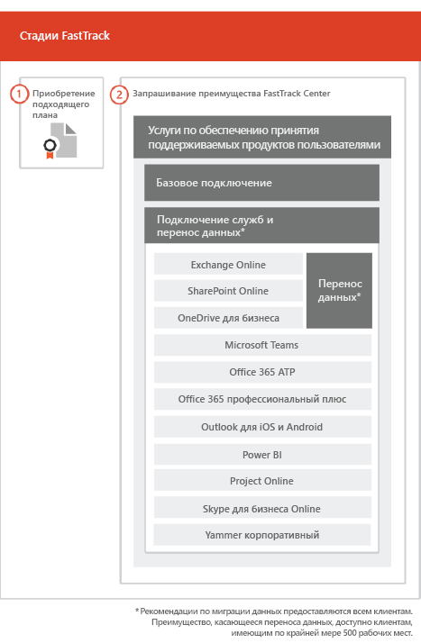

# Процесс FastTrack

Процесс FastTrack предоставляет услуги по подключению и популяризации продукта среди пользователей. 
  
Входящая миграция состоит из указанных ниже частей.
  
- *Базовая подключение* — это задачи, необходимые для настройки клиентов и (при необходимости) интеграции с Azure Active Directory. Кроме того, базовое подключение создает основу для подключения других подходящих служб. 
- *Подключение и миграция служб* — задачи подключения служб позволяют реализовывать сценарии в клиенте. Перенос данных (в том числе электронной почты и файлов) рассматривается в разделе [Перенос данных](O365-data-migration.md). 
    
Услуги по обеспечению принятия продукта пользователями включают задачи с инструкциями по уведомлению пользователей о доступных им службах и о том, как использовать эти службы для повышения эффективности работы. Такая помощь оказывается одновременно с мероприятиями по входящей миграции.
  
> [!NOTE]
> Специалисты FastTrack предоставляют пользователям рекомендации и советы для достижения быстрых и предсказуемых результатов. Если вы выполните развертывание без учета этих рекомендаций, это может сказаться на эффективности подключения и удобстве использования службы. Руководство включает в себя как устные, так и письменные инструкции. Когда специалисты FastTrack предоставляют руководство, они не могут действовать от вашего имени. Пока ваша подписка активна, вы можете с помощью FastTrack подключить любой продукт, соответствующий критериям, и обеспечить его принятие. 
  
## Процесс входящей миграции

На приведенной ниже схеме представлен процесс подключения.
  

  
Вы можете получить помощь через [Центр администрирования Microsoft 365](https://go.microsoft.com/fwlink/?linkid=2032704) или [сайт FastTrack](https://go.microsoft.com/fwlink/?linkid=780698). 

Чтобы получить помощь через [Центр администрирования Microsoft 365](https://go.microsoft.com/fwlink/?linkid=2032704), администратор должен щелкнуть мини-приложение **Нужна помощь?**, войдя в этот центр. 

Чтобы получить помощь через [сайт FastTrack](https://go.microsoft.com/fwlink/?linkid=780698): 
1.  Войдите на [сайт FastTrack](https://go.microsoft.com/fwlink/?linkid=780698). 
2.  Выберите **Услуги**.
3.  Заполните форму **Запрос помощи с Microsoft 365**. 
  
 Вы также можете запросить помощь FastTrack Center на [сайте FastTrack](https://go.microsoft.com/fwlink/?linkid=780698), открыв список доступных услуг для своего клиента. 
    
 Когда начнется поддержка подключения, мы составим расписание собраний по сети.
    
Партнеры могут также получить помощь через [сайт FastTrack](https://go.microsoft.com/fwlink/?linkid=780698) от лица клиента. Для этого:
1.  Войдите на [сайт FastTrack](https://go.microsoft.com/fwlink/?linkid=780698). 
2.  Выберите **Мои пользователи**.
3.  Найдите своего пользователя или выберите его в списке пользователей.
4.  Выберите **Услуги**.
5.  Заполните форму **Запрос помощи с Microsoft 365**. 

В приведенной ниже таблице перечислены роли и обязанности, связанные с процессом FastTrack.
    
|||
|:-----|:-----|
|**Роль**   |**Обязанности**   |
|**Специалист FastTrack**   |В удаленном режиме предоставляет необходимую помощь по обеспечению подключения, миграции, а также адаптации пользователей.    Оказывает удаленную поддержку с помощью инструментов и опубликованной документации.   Работает непосредственно с вами или вашим представителем.   Предоставляет инструкции по переносу электронной почты и данных.|
|**FastTrack Center**    |Предоставляет инструкции по выполнению базового подключения и подключения служб, а также по планированию успешной адаптации пользователей служб, соответствующих критериям.    Осуществляет поддержку и доступен в обычное рабочее время для соответствующего региона.   Предоставляет поддержку на английском, вьетнамском, испанском, итальянском, китайском (традиционное письмо), китайском (упрощенное письмо) (сотрудники разговаривают только на мандаринском диалекте китайского языка), корейском, немецком, португальском (Бразилия), тайском, французском и японском языках.|

  

