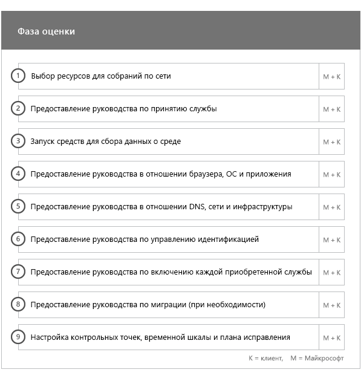
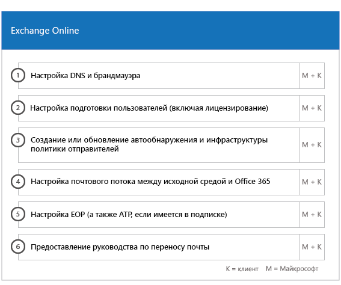
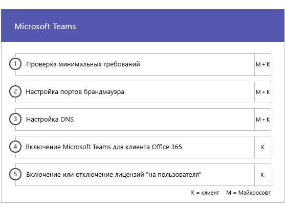
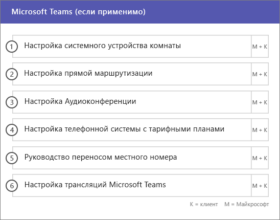
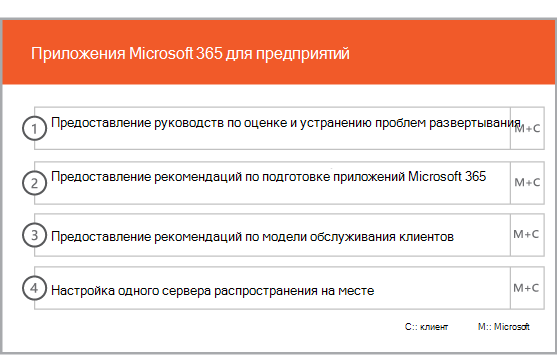

# Фазы подключения и миграцииOnboarding and Migration Phases

Подключение к Office 365 состоит из четырех основных фаз: начальной, оценки, исправления и включения. За этими фазами может следовать фаза переноса данных, как показано на рисунке ниже.Office 365 onboarding has four primary phases—Initiate, Assess, Remediate, and Enable. You can follow these phases with an optional data migration phase as shown in the following figure.
  

  
> [!NOTE]
>Сведения о подключении и миграции для Office 365 для государственных организаций США см. в статье [Подключение и миграция для Office 365 для государственных организаций США](US-Gov-appendix-onboarding-and-migration.md).For information on onboarding and migration for Office 365 US Government, see [Onboarding and Migration for Office 365 US Government](US-Gov-appendix-onboarding-and-migration.md). 

Подробные сведения о задачах на каждом этапе см. в разделах [Обязанности специалистов FastTrack](O365-fasttrack-responsibilities.md) и [Ваши обязанности](O365-your-responsibilities.md).For detailed tasks for each phase, see [FastTrack Responsibilities](O365-fasttrack-responsibilities.md) and [Your Responsibilities](O365-your-responsibilities.md).
  
## Начальная фазаInitiate phase

После приобретения необходимого количества лицензий нужных типов следуйте указаниям из сообщения о подтверждении покупки, чтобы связать лицензии с имеющимся или новым клиентом.After you purchase the appropriate number and types of licenses, follow the guidance from the purchase confirmation email to associate the licenses to your existing or new tenant. 
  
Вы можете получить помощь через [Центр администрирования Microsoft 365](https://go.microsoft.com/fwlink/?linkid=2032704) или [сайт FastTrack](https://go.microsoft.com/fwlink/?linkid=780698).You can get help through the [Microsoft 365 admin center](https://go.microsoft.com/fwlink/?linkid=2032704) or the [FastTrack site](https://go.microsoft.com/fwlink/?linkid=780698). 

Чтобы получить помощь через [Центр администрирования Microsoft 365](https://go.microsoft.com/fwlink/?linkid=2032704), администратор должен щелкнуть мини-приложение **Нужна помощь?**, войдя в этот центр.To get help through the [Microsoft 365 admin center](https://go.microsoft.com/fwlink/?linkid=2032704), your admin signs into the admin center and then clicks the **Need help?** widget. 

Чтобы получить помощь через [сайт FastTrack](https://go.microsoft.com/fwlink/?linkid=780698):To get help through the [FastTrack site](https://go.microsoft.com/fwlink/?linkid=780698): 
1.    Войдите на [сайт FastTrack](https://go.microsoft.com/fwlink/?linkid=780698).Sign in to the [FastTrack site](https://go.microsoft.com/fwlink/?linkid=780698). 
2.    Выберите **Запросить помощь для Microsoft 365** из **быстрых действий** в верхней части начальной страницы.Select **Request assistance with Microsoft 365** from the **quick actions** on the top of your landing page.
3.    Заполните форму **Запросить помощь с Microsoft 365**.Complete the **Request Assistance with Microsoft 365** form.
  
Партнеры могут также получить помощь через [сайт FastTrack](https://go.microsoft.com/fwlink/?linkid=780698) от лица клиента. Для этого:Partners can also get help through the [FastTrack site](https://go.microsoft.com/fwlink/?linkid=780698) on behalf of a customer. To do so:
1.    Войдите на [сайт FastTrack](https://go.microsoft.com/fwlink/?linkid=780698).Sign in to the [FastTrack site](https://go.microsoft.com/fwlink/?linkid=780698). 
2.    Выберите **Запросить помощь для Microsoft 365** из **быстрых действий** в верхней части начальной страницы.Select **Request assistance with Microsoft 365** from the **quick actions** on the top of your landing page.
3.    Найдите своего клиента, указав имя клиента, домен или TPID.Search for your customer by entering the customer name, domain, or TPID.
4.    Выберите клиента в результатах поиска.Select customer from the search results.
5.    Заполните форму **Запросить помощь с Microsoft 365**.Complete the **Request Assistance with Microsoft 365** form.

Вы также можете запросить помощь FastTrack Center на [сайте FastTrack](https://go.microsoft.com/fwlink/?linkid=780698), открыв список доступных услуг для своего клиента.You can also ask for FastTrack Center help from the [FastTrack site](https://go.microsoft.com/fwlink/?linkid=780698) in the list of available services for your tenant. 
    
На этом этапе мы обсудим процесс подключения службы, подтвердим ваши данные и настроим начальное собрание. Кроме того, нам необходимо будет выяснить, каким образом и для каких целей вы планируете использовать службу.During this phase, we discuss the onboarding process, verify your data, and set up a kickoff meeting. This includes working with you to understand how you intend to use the service and your organization's goals and plans to drive service usage.
  

  
## Фаза оценкиAssess phase

Закрепленный за вами менеджер FastTrack проведет с вами и вашими сотрудниками, отвечающими за адаптацию пользователей, интерактивную беседу, посвященную планированию. В ходе беседы вы узнаете о возможностях, которые предоставляют доступные вам службы, о ключевых аспектах, необходимых для достижения успеха, о методологии популяризации служб среди пользователей и о сценариях, применяя которые, можно извлечь пользу от использования служб. Мы поможем вам выполнить планирование и при необходимости дадим рекомендации по ключевым аспектам.Your FastTrack Manager conducts an interactive success planning call with you and your adoption team. This introduces you to the capabilities of the eligible services you purchased, the key foundations you need for success, the methodology for driving usage of the service, and scenarios you can use to get value from the services. We assist you in success planning and provide feedback on key areas (as needed).
  
Специалисты FastTrack помогут вам выполнить оценку исходной среды и необходимых требований. Мы предоставим средства для сбора данных о вашей среде и поможем оценить требования к пропускной способности, браузеры для доступа к Интернету, клиентские операционные системы, службу доменных имен (DNS), сеть, инфраструктуру и систему идентификации, чтобы определить, необходимо ли внести какие-либо изменения перед подключением.FastTrack Specialists work with you to assess your source environment and the requirements. We provide tools for you to gather data about your environment and  guide you through estimating bandwidth requirements and assessing your internet browsers, client operating systems, Domain Name System (DNS), network, infrastructure, and identity system to determine if any changes are required for onboarding. 
  
На основе сведений о текущей конфигурации мы составим план устранения ошибок, выполнение которого обеспечит соответствие исходной среды минимальным требованиям для успешной входящей миграции в Office 365 и (при необходимости) успешный перенос почтовых ящиков и данных. Мы предложим ряд мероприятий для популяризации служб среди конечных пользователей. Кроме того, мы запланируем телефонные беседы по ключевым этапам устранения ошибок.Based on your current setup, we provide a remediation plan that brings your source environment up to the minimum requirements for successful onboarding to Office 365 and, if needed, for successful mailbox and/or data migration. We provide a set of suggested activities to increase end user value and adoption. We also set up appropriate checkpoint calls for the Remediate phase.
  

  
## Фаза исправленияRemediate phase

Задачи устранения ошибок выполняются в соответствии с исходной средой, чтобы обеспечить соответствие требованиям для входящей миграции, внедрения и переноса каждой службы надлежащим образом.You do the remediation tasks based on your source environment so that you meet the requirements for onboarding, adopting, and migrating each service as needed.
  

  
Кроме того, мы предложим ряд мероприятий для популяризации служб среди конечных пользователей. Перед началом этапа включения мы совместно с вами проверим результаты действий по устранению ошибок и убедимся, что вы готовы продолжить работу.We also provide a set of suggested activities to increase end user value and adoption. Before beginning the Enable phase, we jointly verify the outcomes of the remediation activities to make sure you're ready to proceed. 
  
На этом этапе закрепленный за вами менеджер FastTrack поможет выполнить планирование. Он посоветует необходимые ресурсы и даст рекомендации, ознакомившись с которыми, вы сможете сделать службу доступной для вашей организации и обеспечить ее принятие пользователями.During this phase, your FastTrack Manager works with you on success planning, guiding you to the right resources and best practices to provide guidance for you to make the service available to your organization and drive usage across the services.
  
## Фаза включенияEnable phase

После выполнения всех действий по устранению ошибок внимание переключается на настройку основной инфраструктуры для использования служб, подготовку Office 365: и проведение мероприятий по внедрению служб.When all remediation activities are complete, the focus shifts to configuring the core infrastructure for service consumption, provisioning Office 365, and conducting the activities to drive service adoption. 
  
## Базовое подключениеCore

Базовое подключение предусматривает подготовку служб к работе, а также интеграцию клиента и удостоверений. Кроме того, оно предусматривает выполнение действий по созданию базы для подключения служб, например Exchange Online, SharePoint Online и Skype для бизнеса Online. Вы и ваш менеджер FastTrack будете проводить контрольные собрания, чтобы оценить прогресс в достижении поставленных целей и определить, какая дальнейшая помощь нужна.Core onboarding involves service provisioning and tenant and identity integration. It also includes steps for providing a foundation for onboarding services like Exchange Online, SharePoint Online, and Skype for Business Online. You and your FastTrack Manager continue to have success planning checkpoint meetings to evaluate progress against your goals and determine what further assistance you need.
  

  

  
> [!NOTE]
> WAP означает "прокси-служба веб-приложения" (Web Application Proxy). SSL означает Secure Sockets Layer. SDS означает School Data Sync. Дополнительные сведения о Microsoft School Data Sync см. в [этой статье](https://go.microsoft.com/fwlink/?linkid=871480).WAP stands for Web Application Proxy. SSL stands for Secure Sockets Layer. SDS stands for School Data Sync. For more information on SDS, see [Welcome to Microsoft School Data Sync](https://go.microsoft.com/fwlink/?linkid=871480). 
  
Подключение одной или нескольких поддерживаемых служб можно начать после завершения базового подключения.Onboarding for one or more eligible services can begin once core onboarding is finished.
  
## Exchange OnlineExchange Online

В случае Exchange Online мы поможем подготовить вашу организацию к использованию электронной почты. В зависимости от того, каковы ваши планы переноса электронной почты и исходная среда, вы можете получить помощь по следующим вопросам:For Exchange Online, we guide you through the process to get your organization ready to use email. The exact steps, depending on your source environment and your email migration plans, can include providing guidance for:
- Настройка функций Exchange Online Protection (EOP) для всех доменов, поддерживающих почту и проверенных в Office 365.Setting up Exchange Online Protection (EOP) features for all mail-enabled domains validated in Office 365.
    > [!NOTE]
    > Записи обмена электронной почтой (MX) должны указывать на Office 365.Your mail exchange (MX) records must point to Office 365. 
- Настройка функции Office 365 Advanced Threat Protection (ATP), если она включена в вашу подписку.Setting up the Office 365 Advanced Threat Protection (ATP) feature if it's part of your subscription service. Дополнительные сведения см. в статье [Office 365 Advanced Threat Protection](#office-365-advanced-threat-protection).For more information, see [Office 365 Advanced Threat Protection](#office-365-advanced-threat-protection).
- Настройка функции защиты от потери данных (DLP) для всех доменов с включенной поддержкой почты, проверенных в Office 365 в рамках подписки. Это выполняется, когда записи MX указывают на Office 365.Setting up the data loss prevention (DLP) feature for all mail-enabled domains validated in Office 365 as part of your subscription service. This is done once your MX records point to Office 365.
- Настройка шифрования сообщений Office 365 (OME) для всех доменов с включенной поддержкой почты, проверенных в Office 365 в рамках подписки. Это выполняется, когда записи MX указывают на Office 365.Setting up Office 365 Message Encryption (OME) for all mail-enabled domains validated in Office 365 as part of your subscription service. This is done once your MX records point to Office 365.

> [!NOTE]
> Служба репликации почтовых ящиков (MRS) попытается перенести сообщения с управляемыми правами на доступ к данным (IRM) из локального почтового ящика в соответствующий почтовый ящик Exchange Online.The Mailbox Replication service (MRS) attempts to migrate Information Rights Managed (IRM) emails from your on-premises mailbox to the corresponding Exchange Online mailbox. Возможность чтения защищенных данных после переноса зависит от сопоставления клиентом шаблонов службы Active Directory Rights Managed Services (AD RMS) и их копирования в службу Azure Rights Management Service (Azure RMS).Ability to read the protected content post-migration depends on the customer mapping and copying Active Directory Rights Managed Services (AD RMS) templates to the Azure Rights Management Service (Azure RMS).

- Настройка портов брандмауэра.Configuring firewall ports.
- Настройка DNS, в том числе обязательного автообнаружения, инфраструктуры политики отправителей и записей MX (при необходимости).Setting up DNS, including the required Autodiscover, sender policy framework (SPF), and MX records (as needed). 
- Настройка потока обработки почты между исходной средой обмена сообщениями и Exchange Online (при необходимости).Setting up email flow between your source messaging environment and Exchange Online (as needed).
- Перенос почты из исходной среды обмена сообщениями в Office 365.Undertaking mail migration from your source messaging environment to Office 365.
- Настройка почтовых клиентов (Outlook для Windows, Outlook в Интернете, Outlook для iOS и Android).Configuring mailbox clients (Outlook for Windows, Outlook on the web, and Outlook for iOS and Android).
    > [!NOTE]
    > Дополнительные сведения о переносе почты и данных см. в статье [Перенос данных](O365-data-migration.md).For more information on mail and data migration, see [Data Migration](O365-data-migration.md). 
  

  
## SharePoint Online и OneDrive для бизнесаSharePoint Online and OneDrive for Business

Мы предоставляем руководство по следующим вопросам:For SharePoint Online and OneDrive for Business, we provide guidance for:
- Настройка DNS.Setting up DNS.
- Настройка портов брандмауэра.Configuring firewall ports.
- Подготовка пользователей и лицензий.Provisioning users and licenses.   
- Настройка функций гибридной среды SharePoint, таких как гибридный поиск, гибридные сайты, гибридная таксономия, типы контента, гибридная функция самостоятельного создания сайтов (только для SharePoint Server 2013), расширенное средство запуска приложений, гибридная служба OneDrive для бизнеса и сайты экстрасети.Configuring SharePoint hybrid features, like hybrid search, hybrid sites, hybrid taxonomy, content types, hybrid self-service site creation (SharePoint Server 2013 only), extended app launcher, hybrid OneDrive for Business, and extranet sites.
    
Специалисты FastTrack предоставляют необходимые инструменты и документацию по переносу данных в Office 365, а также выполняют настройку в случаях, когда это возможно и целесообразно.FastTrack Specialists provide guidance on data migration to Office 365 by using a combination of tools and documentation and by performing configuration tasks where applicable and feasible.
  

  
## OneDrive для бизнесаOneDrive for Business

Этапы подключения OneDrive для бизнеса зависят от того, используете ли вы SharePoint, и (если это так) от используемой версии.For OneDrive for Business, the steps depend on if you're currently using SharePoint, and if so, which version. 
  

  
## Office 365 Advanced Threat ProtectionOffice 365 Advanced Threat Protection

Вы можете получить помощь с Office 365 ATP по следующим вопросам:For Office 365 ATP, we provide guidance for:
- Включение компонентов "Безопасные ссылки", "Безопасные вложения" и защиты от фишинга.Enabling Safe Links, Safe Attachments, and anti-phishing. 
- Настройка автоматизации, исследований и ответов.Configuring automation, investigation, and response.
- Использование эмулятора атак.Using Attack Simulator.
- Отчеты и анализ угроз.Reporting and threat analytics.

## Управление информацией (Майкрософт)Microsoft Information Governance

Мы предоставляем руководство по следующим вопросам:For Microsoft Information Governance, we provide guidance for:

- Управление информацией.Information governance.
- Метки и политики хранения.Retention labels and policies.
- Управление записями.Records management.
- Политики удаления.Deletion policies.
- Соответствие требованиям к обмену данными.Communication compliance.
- Управление рисками, связанными с инсайдерами.Insider risk management 
- Advanced eDiscovery.Advanced eDiscovery.

## Защита информации (Майкрософт)Microsoft Information Protection

Мы предоставляем руководство по следующим вопросам:For Microsoft Information Protection, we provide guidance for:
- Получение представления о данных с помощью обозревателя содержимого и обозревателя действий.Know your data through content explorer and activity explorer.
- Метки конфиденциальности.Sensitivity labels.
- Классификация данных.Data classification.
- Политики защиты от потери данных для чатов и каналов Microsoft Teams.Data loss protection (DLP) policies for Microsoft Teams chats and channels.
- Защита информации.Information protection.
- Унифицированное применение меток.Unified labeling.

## Microsoft TeamsMicrosoft Teams

Мы предоставляем руководство по следующим вопросам:For Microsoft Teams, we provide guidance for:
- Проверка минимальных требований.Confirming minimum requirements.  
- Настройка портов брандмауэра.Configuring firewall ports.   
- Настройка DNS.Setting up DNS. 
- Подтверждение того, что рабочее пространство Microsoft Teams включено в клиенте Office 365.Confirming Microsoft Teams is enabled on your Office 365 tenant.  
- Включение или отключение пользовательских лицензий.Enabling or disabling user licenses.
    

## Skype для бизнеса OnlineSkype for Business Online

Мы предоставляем руководство по следующим вопросам:For Skype for Business Online, we provide guidance for:
- Настройка портов брандмауэра.Configuring firewall ports.
- Настройка DNS.Setting up DNS.   
- Создание учетных записей для устройств системы комнат.Creating accounts for any room system devices.   
- Развертывание поддерживаемого клиента Skype для бизнеса Online.Deploying a supported Skype for Business Online client.  
- Настройка серверов с разделенным доменом (локальная версия Lync 2010, Lync 2013 или серверная среда Skype для бизнеса 2015 и клиент Skype для бизнеса Online при определенных условиях), компонентов "План звонков", "Трансляция собраний Skype", а также компонентов "Телефонная система" и "План звонков" (не во всех регионах).Establishing split domain server configuration between your on-premises Lync 2010, Lync 2013, or Skype for Business 2015 server environment and Skype for Business Online tenant (if applicable), Calling Plans, Skype Meeting Broadcast, and Phone System and Calling Plans (in available markets).
    

  

  
## Power BIPower BI

Мы предоставляем руководство по следующим вопросам:For Power BI, we provide guidance for: 
- Назначение лицензий на Power BI.Assigning Power BI licenses.
- Развертывание приложения Power BI Desktop.Deploying the Power BI Desktop app.
    
## Project OnlineProject Online

Мы предоставляем руководство по следующим вопросам:For Project Online, we provide guidance for:
  
- Проверка основных функций SharePoint, необходимых для работы Project Online.Verifying basic SharePoint functionality that Project Online relies on.   
- Добавление службы Project Online в клиент (в том числе добавление подписок для пользователей).Adding the Project Online service to your tenant (including adding subscriptions to users).  
- Настройка пула корпоративных ресурсов (ERP).Setting up the Enterprise Resource Pool (ERP). 
- Создание первого проекта.Creating your first project. 
    

  
## Project Online профессиональный и расширенныйProject Online Professional and Project Online Premium

Мы предоставляем руководство по следующим вопросам:For Project Online Professional and Project Online Premium, we provide guidance for:
- Решение проблем, связанных с развертыванием.Addressing deployment issues.
- Назначение пользователям лицензий с помощью [Центра администрирования Microsoft 365](https://go.microsoft.com/fwlink/?linkid=2032704) и Windows PowerShell.Assigning end-user licenses using the [Microsoft 365 admin center](https://go.microsoft.com/fwlink/?linkid=2032704) and Windows PowerShell.  
- Установка клиента Project Online для настольных ПК с использованием портала Office 365 и технологии "нажми и работай".Installing Project Online Desktop Client from the Office 365 portal using Click-to-Run.
- Настройка параметров обновления с помощью средства развертывания Office 365.Configuring update settings using the Office 365 Deployment Tool.  
- Настройка одного внутреннего сервера распространения для клиента Project Online для настольных ПК, в том числе помощь по созданию файла configuration.xml для его последующего использования в средстве развертывания Office 365.Setting up a single on-site distribution server for Project Online Desktop Client, including assistance with the creation of a configuration.xml file for use with the Office 365 Deployment Tool.  
- Подключение клиента Project Online для настольных ПК к Project Online профессиональный или Project Online расширенный.Connecting Project Online Desktop Client to Project Online Professional or Project Online Premium.
    

  
## Yammer корпоративныйYammer Enterprise

Мы предоставляем руководство по включению службы Yammer Enterprise.For Yammer, we provide guidance for enabling the Yammer Enterprise service.
  
## Приложения Microsoft 365Microsoft 365 Apps

Мы предоставляем руководство по следующим вопросам:For Microsoft 365 Apps, we provide guidance for:
- Решение проблем, связанных с развертыванием.Addressing deployment issues.   
- Назначение пользователям и устройствам лицензий с помощью [Центра администрирования Microsoft 365](https://go.microsoft.com/fwlink/?linkid=2032704) и Windows PowerShell.Assigning end-user and device-based licenses using the [Microsoft 365 admin center](https://go.microsoft.com/fwlink/?linkid=2032704) and Windows PowerShell. 
- Установка приложений Microsoft 365 с портала Office 365 с помощью технологии "нажми и работай".Installing Microsoft 365 Apps from the Office 365 portal using Click-to-Run.   
- Установка приложений Office Mobile (например, Outlook Mobile, Word Mobile, Excel Mobile и PowerPoint Mobile) на устройствах с iOS или Android.Installing Office Mobile apps (like Outlook Mobile, Word Mobile, Excel Mobile, and PowerPoint Mobile) on your iOS or Android devices.   
- Настройка параметров обновления с помощью средства развертывания Office 365.Configuring update settings using the Office 365 Deployment Tool.   
- Выбор и настройка локальной или облачной установки.Selection and setup of a local or cloud installation. 
- Создание XML-файла конфигурации средства развертывания Office с помощью центра развертывания Office или встроенного XML-файла для настройки пакета развертывания.Creation of the Office Deployment Tool configuration XML with the Office Customization Tool or native XML to configure the deployment package.  
- Развертывание с помощью Microsoft Endpoint Configuration Manager, а также создание пакета Microsoft Endpoint Configuration Manager.Deployment using Microsoft Endpoint Configuration Manager, including assistance with the creation of Microsoft Endpoint Configuration Manager packaging.
    

  
## Outlook для iOS и AndroidOutlook for iOS and Android

Вы можете получить помощь с Outlook для iOS и Android по указанным ниже вопросам.For Outlook for iOS and Android, we provide guidance for:
- Скачивание Outlook для iOS и Android через Apple App Store или Google Play.Downloading Outlook for iOS and Android from the Apple App Store and Google Play.
- Настройка учетных записей и оценка почтового ящика Exchange Online.Configuring accounts and accessing the Exchange Online mailbox.
