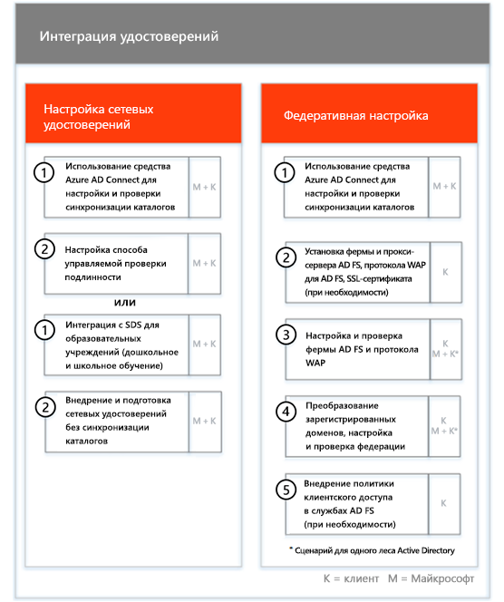

# Фазы подключения и миграцииOnboarding and Migration Phases

Подключение к Office 365 состоит из четырех основных фаз: начальной, оценки, исправления и включения. За этими фазами может следовать фаза переноса данных, как показано на рисунке ниже.Office 365 onboarding has four primary phases—Initiate, Assess, Remediate, and Enable. You can follow these phases with an optional data migration phase as shown in the following figure.
  

  
> [!NOTE]
>Сведения о подключении и миграции для Office 365 для государственных организаций США см. в статье [Подключение и миграция для Office 365 для государственных организаций США](US-Gov-appendix-onboarding-and-migration.md).For information on onboarding and migration for Office 365 US Government, see [Onboarding and Migration for Office 365 US Government](US-Gov-appendix-onboarding-and-migration.md). 

Подробные сведения о задачах на каждом этапе см. в разделах [Обязанности специалистов FastTrack](O365-fasttrack-responsibilities.md) и [Ваши обязанности](O365-your-responsibilities.md).For detailed tasks for each phase, see [FastTrack Responsibilities](O365-fasttrack-responsibilities.md) and [Your Responsibilities](O365-your-responsibilities.md).
  
## Начальная фазаInitiate phase

После приобретения необходимого количества лицензий нужных типов следуйте указаниям из сообщения о подтверждении покупки, чтобы связать лицензии с имеющимся или новым клиентом.After you purchase the appropriate number and types of licenses, follow the guidance from the purchase confirmation email to associate the licenses to your existing or new tenant. 
  
Вы можете получить помощь через [Центр администрирования Microsoft 365](https://go.microsoft.com/fwlink/?linkid=2032704) или [сайт FastTrack](https://go.microsoft.com/fwlink/?linkid=780698).You can get help through the [Microsoft 365 admin center](https://go.microsoft.com/fwlink/?linkid=2032704) or the [FastTrack site](https://go.microsoft.com/fwlink/?linkid=780698). 

Чтобы получить помощь через [Центр администрирования Microsoft 365](https://go.microsoft.com/fwlink/?linkid=2032704), администратор должен щелкнуть мини-приложение **Нужна помощь?**, войдя в этот центр.To get help through the [Microsoft 365 admin center](https://go.microsoft.com/fwlink/?linkid=2032704), your admin signs into the admin center and then clicks the **Need help?** widget. 

Чтобы получить помощь через [сайт FastTrack](https://go.microsoft.com/fwlink/?linkid=780698):To get help through the [FastTrack site](https://go.microsoft.com/fwlink/?linkid=780698): 
1.  Войдите на [сайт FastTrack](https://go.microsoft.com/fwlink/?linkid=780698).Sign in to the [FastTrack site](https://go.microsoft.com/fwlink/?linkid=780698). 
2.  Выберите **FastTrack**.Select **FastTrack**.
3.  Выберите **Услуги**.Select **Services**.
4.  Заполните форму **Запрос помощи с Microsoft 365**.Complete the **Request for Assistance with Microsoft 365** form. 
> [!NOTE]
>  Если в клиенте Office 365 указан партнер, этот параметр не будет отображаться. Для получения помощи обратитесь к партнеру.If you have a partner listed in your Office 365 tenant, you won't see this option. Please consult your partner for assistance. 
  
Партнеры могут также получить помощь через [сайт FastTrack](https://go.microsoft.com/fwlink/?linkid=780698) от лица клиента. Для этого:Partners can also get help through the [FastTrack site](https://go.microsoft.com/fwlink/?linkid=780698) on behalf of a customer. To do so:
1.  Войдите на [сайт FastTrack](https://go.microsoft.com/fwlink/?linkid=780698).Sign in to the [FastTrack site](https://go.microsoft.com/fwlink/?linkid=780698). 
2.  Выберите **FastTrack**.Select **FastTrack**.
3.  Выберите **Мои пользователи**.Select **My Customers**.
4.  Найдите своего пользователя или выберите его в списке пользователей.Search for your customer or select them from your customer list.
5.  Выберите **Услуги**.Select **Services**.
6.  Заполните форму **Запрос помощи с Microsoft 365**.Complete the **Request for Assistance with Microsoft 365** form.

Вы также можете запросить помощь FastTrack Center на [сайте FastTrack](https://go.microsoft.com/fwlink/?linkid=780698), открыв список доступных услуг для своего клиента.You can also ask for FastTrack Center help from the [FastTrack site](https://go.microsoft.com/fwlink/?linkid=780698) in the list of available services for your tenant. 
    
На этом этапе мы обсудим процесс подключения службы, подтвердим ваши данные и настроим начальное собрание. Кроме того, нам необходимо будет выяснить, каким образом и для каких целей вы планируете использовать службу.During this phase, we discuss the onboarding process, verify your data, and set up a kickoff meeting. This includes working with you to understand how you intend to use the service and your organization's goals and plans to drive service usage.
  

  
## Фаза оценкиAssess phase

Закрепленный за вами менеджер FastTrack проведет с вами и вашими сотрудниками, отвечающими за адаптацию пользователей, интерактивную беседу, посвященную планированию. В ходе беседы вы узнаете о возможностях, которые предоставляют доступные вам службы, о ключевых аспектах, необходимых для достижения успеха, о методологии популяризации служб среди пользователей и о сценариях, применяя которые, можно извлечь пользу от использования служб. Мы поможем вам выполнить планирование и при необходимости дадим рекомендации по ключевым аспектам.Your FastTrack Manager conducts an interactive success planning call with you and your adoption team. This introduces you to the capabilities of the eligible services you purchased, the key foundations you need for success, the methodology for driving usage of the service, and scenarios you can use to get value from the services. We assist you in success planning and provide feedback on key areas (as needed).
  
Специалисты FastTrack помогут вам выполнить оценку исходной среды и необходимых требований. Мы предоставим средства для сбора данных о вашей среде и поможем оценить требования к пропускной способности, браузеры для доступа к Интернету, клиентские операционные системы, службу доменных имен (DNS), сеть, инфраструктуру и систему идентификации, чтобы определить, необходимо ли внести какие-либо изменения перед подключением.FastTrack Specialists work with you to assess your source environment and the requirements. We provide tools for you to gather data about your environment and  guide you through estimating bandwidth requirements and assessing your internet browsers, client operating systems, Domain Name System (DNS), network, infrastructure, and identity system to determine if any changes are required for onboarding. 
  
На основе сведений о текущей конфигурации мы составим план устранения ошибок, выполнение которого обеспечит соответствие исходной среды минимальным требованиям для успешной входящей миграции в Office 365 и (при необходимости) успешный перенос почтовых ящиков и данных. Мы предложим ряд мероприятий для популяризации служб среди конечных пользователей. Кроме того, мы запланируем телефонные беседы по ключевым этапам устранения ошибок.Based on your current setup, we provide a remediation plan that brings your source environment up to the minimum requirements for successful onboarding to Office 365 and, if needed, for successful mailbox and/or data migration. We provide a set of suggested activities to increase end user value and adoption. We also set up appropriate checkpoint calls for the Remediate phase.
  

  
## Фаза исправленияRemediate phase

Задачи устранения ошибок выполняются в соответствии с исходной средой, чтобы обеспечить соответствие требованиям для входящей миграции, внедрения и переноса каждой службы надлежащим образом.You do the remediation tasks based on your source environment so that you meet the requirements for onboarding, adopting, and migrating each service as needed.
  

  
Кроме того, мы предложим ряд мероприятий для популяризации служб среди конечных пользователей. Перед началом этапа включения мы совместно с вами проверим результаты действий по устранению ошибок и убедимся, что вы готовы продолжить работу.We also provide a set of suggested activities to increase end user value and adoption. Before beginning the Enable phase, we jointly verify the outcomes of the remediation activities to make sure you're ready to proceed. 
  
На этом этапе закрепленный за вами менеджер FastTrack поможет выполнить планирование. Он посоветует необходимые ресурсы и даст рекомендации, ознакомившись с которыми, вы сможете сделать службу доступной для вашей организации и обеспечить ее принятие пользователями.During this phase, your FastTrack Manager works with you on success planning, guiding you to the right resources and best practices to provide guidance for you to make the service available to your organization and drive usage across the services.
  
## Фаза включенияEnable phase

После выполнения всех действий по устранению ошибок внимание переключается на настройку основной инфраструктуры для использования служб, подготовку Office 365: и проведение мероприятий по внедрению служб.When all remediation activities are complete, the focus shifts to configuring the core infrastructure for service consumption, provisioning Office 365, and conducting the activities to drive service adoption. 
  
## Базовое подключениеCore

Базовое подключение предусматривает подготовку служб к работе, а также интеграцию клиента и удостоверений. Кроме того, оно предусматривает выполнение действий по созданию базы для подключения служб, например Exchange Online, SharePoint Online и Skype для бизнеса Online. Вы и ваш менеджер FastTrack будете проводить контрольные собрания, чтобы оценить прогресс в достижении поставленных целей и определить, какая дальнейшая помощь нужна.Core onboarding involves service provisioning and tenant and identity integration. It also includes steps for providing a foundation for onboarding services like Exchange Online, SharePoint Online, and Skype for Business Online. You and your FastTrack Manager continue to have success planning checkpoint meetings to evaluate progress against your goals and determine what further assistance you need.
  

  

  
> [!NOTE]
> WAP означает "прокси-служба веб-приложения" (Web Application Proxy). SSL означает Secure Sockets Layer. SDS означает School Data Sync. Дополнительные сведения о Microsoft School Data Sync см. в [этой статье](https://go.microsoft.com/fwlink/?linkid=871480).WAP stands for Web Application Proxy. SSL stands for Secure Sockets Layer. SDS stands for School Data Sync. For more information on SDS, see [Welcome to Microsoft School Data Sync](https://go.microsoft.com/fwlink/?linkid=871480). 
  
Подключение одной или нескольких поддерживаемых служб можно начать после завершения базового подключения.Onboarding for one or more eligible services can begin once core onboarding is finished.
  
## Exchange OnlineExchange Online

В случае Exchange Online мы поможем подготовить вашу организацию к использованию электронной почты. В зависимости от того, каковы ваши планы переноса электронной почты и исходная среда, вы можете получить помощь по следующим вопросам:For Exchange Online, we guide you through the process to get your organization ready to use email. The exact steps, depending on your source environment and your email migration plans, can include providing guidance for:
- Настройка функций Exchange Online Protection (EOP) для всех доменов, поддерживающих почту и проверенных в Office 365.Setting up Exchange Online Protection (EOP) features for all mail-enabled domains validated in Office 365.
    > [!NOTE]
    > Записи обмена электронной почтой (MX) должны указывать на Office 365.Your mail exchange (MX) records must point to Office 365. 
- Настройка функции Exchange Online Advanced Threat Protection (ATP), если она входит в состав подписки, когда записи MX указывают на Office 365:. Эта функция настраивается вместе с другими параметрами защиты от вредоносного ПО в Exchange Online Protection.Setting up the Exchange Online Advanced Threat Protection (ATP) feature if it's part of your subscription service once your MX records point to Office 365. This feature is configured as part of the Exchange Online Protection antimalware settings.
- Настройка портов брандмауэра.Configuring firewall ports.
- Настройка DNS, в том числе обязательного автообнаружения, инфраструктуры политики отправителей и записей MX (при необходимости).Setting up DNS, including the required Autodiscover, sender policy framework (SPF), and MX records (as needed). 
- Настройка потока обработки почты между исходной средой обмена сообщениями и Exchange Online (при необходимости).Setting up email flow between your source messaging environment and Exchange Online (as needed).
- Перенос почты из исходной среды обмена сообщениями в Office 365.Undertaking mail migration from your source messaging environment to Office 365.
- Настройка почтовых клиентов (Outlook для Windows, Outlook в Интернете, Outlook для iOS и Android).Configuring mailbox clients (Outlook for Windows, Outlook on the web, and Outlook for iOS and Android).
    > [!NOTE]
    > Дополнительные сведения о переносе почты и данных см. в статье [Перенос данных](O365-data-migration.md).For more information on mail and data migration, see [Data Migration](O365-data-migration.md). 
  

  
## SharePoint Online и OneDrive для бизнесаSharePoint Online and OneDrive for Business

Мы предоставляем руководство по следующим вопросам:For SharePoint Online and OneDrive for Business, we provide guidance for:
- Настройка DNS.Setting up DNS.
- Настройка портов брандмауэра.Configuring firewall ports.
- Подготовка пользователей и лицензий.Provisioning users and licenses.   
- Настройка функций гибридной среды SharePoint, таких как гибридный поиск, гибридные сайты, гибридная таксономия, типы контента, гибридная функция самостоятельного создания сайтов (только для SharePoint Server 2013), расширенное средство запуска приложений, гибридная служба OneDrive для бизнеса и сайты экстрасети.Configuring SharePoint Hybrid features, like hybrid search, hybrid sites, hybrid taxonomy, content types, hybrid self-service site creation (SharePoint Server 2013 only), extended app launcher, hybrid OneDrive for Business, and extranet sites.
    
Специалисты FastTrack предоставляют необходимые инструменты и документацию по переносу данных в Office 365:, а также выполняют настройку в случаях, когда это возможно и целесообразно.FastTrack Specialists provide guidance on data migration to Office 365 by using a combination of tools and documentation and by performing configuration tasks where applicable and feasible.
  

  
## OneDrive для бизнесаOneDrive for Business

Этапы подключения OneDrive для бизнеса зависят от того, используете ли вы SharePoint, и (если это так) от используемой версии.For OneDrive for Business, the steps depend on if you're currently using SharePoint, and if so, which version. 
  

  
## Skype для бизнеса OnlineSkype for Business Online

Мы предоставляем руководство по следующим вопросам:For Skype for Business Online, we provide guidance for:
- Настройка портов брандмауэра.Configuring firewall ports.
- Настройка DNS.Setting up DNS.   
- Создание учетных записей для устройств системы комнат.Creating accounts for any room system devices.   
- Развертывание поддерживаемого клиента Skype для бизнеса Online.Deploying a supported Skype for Business Online client.  
- Настройка серверов с разделенным доменом (локальная версия Lync 2010, Lync 2013 или серверная среда Skype для бизнеса 2015 и клиент Skype для бизнеса Online при определенных условиях), компонентов "План звонков", "Трансляция собраний Skype", а также компонентов "Телефонная система" и "План звонков" (не во всех регионах).Establishing split domain server configuration between your on-premises Lync 2010, Lync 2013, or Skype for Business 2015 server environment and Skype for Business Online tenant (if applicable), Calling Plans, Skype Meeting Broadcast, and Phone System and Calling Plans (in available markets).
    

  

  
## Microsoft TeamsMicrosoft Teams

Мы предоставляем руководство по следующим вопросам:For Microsoft Teams, we provide guidance for:
- Проверка минимальных требований.Confirming minimum requirements.  
- Настройка портов брандмауэра.Configuring firewall ports.   
- Настройка DNS.Setting up DNS. 
- Подтверждение того, что рабочее пространство Microsoft Teams включено в клиенте Office 365:.Confirming Microsoft Teams is enabled on your Office 365 tenant.  
- Включение или отключение пользовательских лицензий.Enabling or disabling user licenses.
    

  
## Power BIPower BI

Мы предоставляем руководство по следующим вопросам:For Power BI, we provide guidance for: 
- Назначение лицензий на Power BI.Assigning Power BI licenses.
- Развертывание приложения Power BI Desktop.Deploying the Power BI Desktop app.
    
## Project OnlineProject Online

Мы предоставляем руководство по следующим вопросам:For Project Online, we provide guidance for:
  
- Проверка основных функций SharePoint, необходимых для работы Project Online.Verifying basic SharePoint functionality that Project Online relies on.   
- Добавление службы Project Online в клиент (в том числе добавление подписок для пользователей).Adding the Project Online service to your tenant (including adding subscriptions to users).  
- Настройка пула корпоративных ресурсов (ERP).Setting up the Enterprise Resource Pool (ERP). 
- Создание первого проекта.Creating your first project. 
    

  
## Project Online профессиональный и расширенныйProject Online Professional and Project Online Premium

Мы предоставляем руководство по следующим вопросам:For Project Online Professional and Project Online Premium, we provide guidance for:
- Решение проблем, связанных с развертыванием.Addressing deployment issues.
- Назначение пользователям лицензий с помощью [Центра администрирования Microsoft 365](https://go.microsoft.com/fwlink/?linkid=2032704) и Windows PowerShell.Assigning end-user licenses using the [Microsoft 365 admin center](https://go.microsoft.com/fwlink/?linkid=2032704) and Windows PowerShell.  
- Установка клиента Project Online для настольных ПК с использованием портала Office 365 и технологии "нажми и работай".Installing Project Online Desktop Client from the Office 365 portal using Click-to-Run.
- Настройка параметров обновления с помощью средства развертывания Office.Configuring update settings using the Office Deployment Tool.  
- Настройка одного внутреннего сервера распространения для клиента Project Online для настольных ПК, в том числе помощь по созданию файла configuration.xml для его последующего использования в средстве развертывания Office.Setting up a single on-site distribution server for Project Online Desktop Client, including assistance with the creation of a configuration.xml file for use with the Office Deployment Tool.  
- Подключение клиента Project Online для настольных ПК к Project Online профессиональный или Project Online расширенный.Connecting Project Online Desktop Client to Project Online Professional or Project Online Premium.
    

  
## Yammer корпоративныйYammer Enterprise

Мы предоставляем руководство по включению службы Yammer Enterprise.For Yammer, we provide guidance for enabling the Yammer Enterprise service.
  
## Office 365 профессиональный плюсOffice 365 ProPlus

Мы предоставляем руководство по следующим вопросам:For Office 365 ProPlus, we provide guidance for:
- Решение проблем, связанных с развертыванием.Addressing deployment issues.   
- Назначение пользователям лицензий с помощью [Центра администрирования Microsoft 365](https://go.microsoft.com/fwlink/?linkid=2032704) и Windows PowerShell.Assigning end-user licenses using the [Microsoft 365 admin center](https://go.microsoft.com/fwlink/?linkid=2032704) and Windows PowerShell. 
- Установка Office 365 профессиональный плюс с использованием портала Office 365 и технологии "нажми и работай".Installing Office 365 ProPlus from the Office 365 portal using Click-to-Run.   
- Установка приложений Office Mobile (например, Outlook Mobile, Word Mobile, Excel Mobile, русская версия и PowerPoint Mobile) на устройствах с iOS, Android или Windows Mobile.Installing Office Mobile apps (like Outlook Mobile, Word Mobile, Excel Mobile, and PowerPoint Mobile) on your iOS, Android, or Windows Mobile devices.   
- Настройка параметров обновления с помощью средства развертывания Office.Configuring update settings using the Office Deployment Tool.   
- Настройка одного внутреннего сервера распространения для Office 365 профессиональный плюс, в том числе помощь по созданию файла configuration.xml для его последующего использования в средстве развертывания Office.Setting up a single on-site distribution server for Office 365 ProPlus, including assistance with the creation of a configuration.xml file for use with the Office Deployment Tool.  
- Развертывание с помощью Microsoft System Center Configuration Manager, а также создание упаковки System Center Configuration Manager.Deployment using Microsoft System Center Configuration Manager, including assistance with the creation of System Center Configuration Manager packaging.
    

  
## Microsoft StaffHubMicrosoft StaffHub

Мы предоставляем руководство по следующим вопросам:For Microsoft StaffHub, we provide guidance for:
- Подтверждение того, что приложение Microsoft StaffHub включено для клиента Office 365:.Confirming Microsoft StaffHub is enabled on your Office 365 tenant.
- Включение или отключение пользовательских лицензий.Enabling or disabling user licenses.
- Основные функции продукта.Core product features. 
- Расположения для скачивания в случае Microsoft StaffHub.Download locations for Microsoft StaffHub.
    

  
## Outlook для iOS и AndroidOutlook for iOS and Android

Вы можете получить помощь с Outlook для iOS и Android по указанным ниже вопросам.For Outlook for iOS and Android, we provide guidance for:
- Скачивание Outlook для iOS и Android через Apple App Store или Google Play.Downloading Outlook for iOS and Android from the Apple App Store and Google Play.
- Настройка учетных записей и оценка почтового ящика Exchange Online.Configuring accounts and accessing the Exchange Online mailbox.

