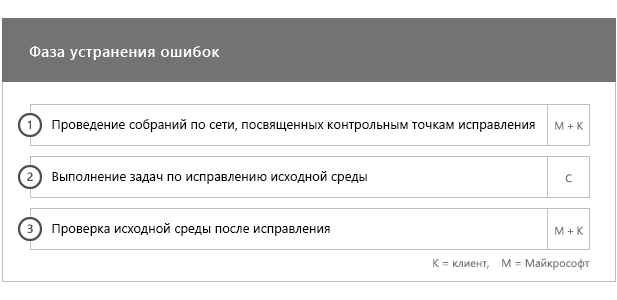

# Фазы подключения и миграции

Подключение к Office 365 состоит из четырех основных фаз: начальной, оценки, исправления и включения. За этими фазами может следовать фаза переноса данных, как показано на рисунке ниже.
  

  
> [!NOTE]
>Сведения о подключении и миграции для Office 365 для государственных организаций США см. в статье [Подключение и миграция для Office 365 для государственных организаций США](US-Gov-appendix-onboarding-and-migration.md). 

Подробные сведения о задачах на каждом этапе см. в разделах [Обязанности специалистов FastTrack](O365-fasttrack-responsibilities.md) и [Ваши обязанности](O365-your-responsibilities.md).
  
## Начальная фаза

После приобретения необходимого количества лицензий нужных типов следуйте указаниям из сообщения о подтверждении покупки, чтобы связать лицензии с имеющимся или новым клиентом. 
  
Вы можете получить помощь через [Центр администрирования Microsoft 365](https://go.microsoft.com/fwlink/?linkid=2032704) или [сайт FastTrack](https://go.microsoft.com/fwlink/?linkid=780698). 

Чтобы получить помощь через [Центр администрирования Microsoft 365](https://go.microsoft.com/fwlink/?linkid=2032704), администратор должен щелкнуть мини-приложение **Нужна помощь?**, войдя в этот центр. 

Чтобы получить помощь через [сайт FastTrack](https://go.microsoft.com/fwlink/?linkid=780698): 
1.  Войдите на [сайт FastTrack](https://go.microsoft.com/fwlink/?linkid=780698). 
2.  Выберите **Услуги**.
3.  Заполните форму **Запрос помощи с Microsoft 365**. 
> [!NOTE]
>  Если в клиенте Office 365 указан партнер, этот параметр не будет отображаться. Для получения помощи обратитесь к партнеру. 
  
Партнеры могут также получить помощь через [сайт FastTrack](https://go.microsoft.com/fwlink/?linkid=780698) от лица клиента. Для этого:
1.  Войдите на [сайт FastTrack](https://go.microsoft.com/fwlink/?linkid=780698). 
2.  Выберите **Мои пользователи**.
3.  Найдите своего пользователя или выберите его в списке пользователей.
4.  Выберите **Услуги**.
5.  Заполните форму **Запрос помощи с Microsoft 365**.

Вы также можете запросить помощь FastTrack Center на [сайте FastTrack](https://go.microsoft.com/fwlink/?linkid=780698), открыв список доступных услуг для своего клиента. 
    
На этом этапе мы обсудим процесс подключения службы, подтвердим ваши данные и настроим начальное собрание. Кроме того, нам необходимо будет выяснить, каким образом и для каких целей вы планируете использовать службу.
  

  
## Фаза оценки

Закрепленный за вами менеджер FastTrack проведет с вами и вашими сотрудниками, отвечающими за адаптацию пользователей, интерактивную беседу, посвященную планированию. В ходе беседы вы узнаете о возможностях, которые предоставляют доступные вам службы, о ключевых аспектах, необходимых для достижения успеха, о методологии популяризации служб среди пользователей и о сценариях, применяя которые, можно извлечь пользу от использования служб. Мы поможем вам выполнить планирование и при необходимости дадим рекомендации по ключевым аспектам.
  
Специалисты FastTrack помогут вам выполнить оценку исходной среды и необходимых требований. Мы предоставим средства для сбора данных о вашей среде и поможем оценить требования к пропускной способности, браузеры для доступа к Интернету, клиентские операционные системы, службу доменных имен (DNS), сеть, инфраструктуру и систему идентификации, чтобы определить, необходимо ли внести какие-либо изменения перед подключением. 
  
На основе сведений о текущей конфигурации мы составим план устранения ошибок, выполнение которого обеспечит соответствие исходной среды минимальным требованиям для успешной входящей миграции в Office 365 и (при необходимости) успешный перенос почтовых ящиков и данных. Мы предложим ряд мероприятий для популяризации служб среди конечных пользователей. Кроме того, мы запланируем телефонные беседы по ключевым этапам устранения ошибок.
  

  
## Фаза исправления

Задачи устранения ошибок выполняются в соответствии с исходной средой, чтобы обеспечить соответствие требованиям для входящей миграции, внедрения и переноса каждой службы надлежащим образом.
  

  
Кроме того, мы предложим ряд мероприятий для популяризации служб среди конечных пользователей. Перед началом этапа включения мы совместно с вами проверим результаты действий по устранению ошибок и убедимся, что вы готовы продолжить работу. 
  
На этом этапе закрепленный за вами менеджер FastTrack поможет выполнить планирование. Он посоветует необходимые ресурсы и даст рекомендации, ознакомившись с которыми, вы сможете сделать службу доступной для вашей организации и обеспечить ее принятие пользователями.
  
## Фаза включения

После выполнения всех действий по устранению ошибок внимание переключается на настройку основной инфраструктуры для использования служб, подготовку Office 365: и проведение мероприятий по внедрению служб. 
  
## Базовое подключение

Базовое подключение предусматривает подготовку служб к работе, а также интеграцию клиента и удостоверений. Кроме того, оно предусматривает выполнение действий по созданию базы для подключения служб, например Exchange Online, SharePoint Online и Skype для бизнеса Online. Вы и ваш менеджер FastTrack будете проводить контрольные собрания, чтобы оценить прогресс в достижении поставленных целей и определить, какая дальнейшая помощь нужна.
  

  

  
> [!NOTE]
> WAP означает "прокси-служба веб-приложения" (Web Application Proxy). SSL означает Secure Sockets Layer. SDS означает School Data Sync. Дополнительные сведения о Microsoft School Data Sync см. в [этой статье](https://go.microsoft.com/fwlink/?linkid=871480). 
  
Подключение одной или нескольких поддерживаемых служб можно начать после завершения базового подключения.
  
## Exchange Online

В случае Exchange Online мы поможем подготовить вашу организацию к использованию электронной почты. В зависимости от того, каковы ваши планы переноса электронной почты и исходная среда, вы можете получить помощь по следующим вопросам:
- Настройка функций Exchange Online Protection (EOP) для всех доменов, поддерживающих почту и проверенных в Office 365.
    > [!NOTE]
    > Записи обмена электронной почтой (MX) должны указывать на Office 365. 
- Настройка функции Exchange Online Advanced Threat Protection (ATP), если она входит в состав подписки. Это выполняется, когда записи MX указывают на Office 365. Эта функция настраивается вместе с другими параметрами защиты от вредоносного ПО в Exchange Online Protection.
- Настройка функции защиты от потери данных (DLP) для всех доменов с включенной поддержкой почты, проверенных в Office 365 в рамках подписки. Это выполняется, когда записи MX указывают на Office 365.
- Настройка шифрования сообщений Office 365 (OME) для всех доменов с включенной поддержкой почты, проверенных в Office 365 в рамках подписки. Это выполняется, когда записи MX указывают на Office 365.
- Настройка портов брандмауэра.
- Настройка DNS, в том числе обязательного автообнаружения, инфраструктуры политики отправителей и записей MX (при необходимости). 
- Настройка потока обработки почты между исходной средой обмена сообщениями и Exchange Online (при необходимости).
- Перенос почты из исходной среды обмена сообщениями в Office 365.
- Настройка почтовых клиентов (Outlook для Windows, Outlook в Интернете, Outlook для iOS и Android).
    > [!NOTE]
    > Дополнительные сведения о переносе почты и данных см. в статье [Перенос данных](O365-data-migration.md). 
  

  
## SharePoint Online и OneDrive для бизнеса

Мы предоставляем руководство по следующим вопросам:
- Настройка DNS.
- Настройка портов брандмауэра.
- Подготовка пользователей и лицензий.   
- Настройка функций гибридной среды SharePoint, таких как гибридный поиск, гибридные сайты, гибридная таксономия, типы контента, гибридная функция самостоятельного создания сайтов (только для SharePoint Server 2013), расширенное средство запуска приложений, гибридная служба OneDrive для бизнеса и сайты экстрасети.
    
Специалисты FastTrack предоставляют необходимые инструменты и документацию по переносу данных в Office 365, а также выполняют настройку в случаях, когда это возможно и целесообразно.
  

  
## OneDrive для бизнеса

Этапы подключения OneDrive для бизнеса зависят от того, используете ли вы SharePoint, и (если это так) от используемой версии. 
  

  
## Microsoft Teams

Мы предоставляем руководство по следующим вопросам:
- Проверка минимальных требований.  
- Настройка портов брандмауэра.   
- Настройка DNS. 
- Подтверждение того, что рабочее пространство Microsoft Teams включено в клиенте Office 365.  
- Включение или отключение пользовательских лицензий.
    

## Skype для бизнеса Online

Мы предоставляем руководство по следующим вопросам:
- Настройка портов брандмауэра.
- Настройка DNS.   
- Создание учетных записей для устройств системы комнат.   
- Развертывание поддерживаемого клиента Skype для бизнеса Online.  
- Настройка серверов с разделенным доменом (локальная версия Lync 2010, Lync 2013 или серверная среда Skype для бизнеса 2015 и клиент Skype для бизнеса Online при определенных условиях), компонентов "План звонков", "Трансляция собраний Skype", а также компонентов "Телефонная система" и "План звонков" (не во всех регионах).
    

  

  
## Power BI

Мы предоставляем руководство по следующим вопросам: 
- Назначение лицензий на Power BI.
- Развертывание приложения Power BI Desktop.
    
## Project Online

Мы предоставляем руководство по следующим вопросам:
  
- Проверка основных функций SharePoint, необходимых для работы Project Online.   
- Добавление службы Project Online в клиент (в том числе добавление подписок для пользователей).  
- Настройка пула корпоративных ресурсов (ERP). 
- Создание первого проекта. 
    

  
## Project Online профессиональный и расширенный

Мы предоставляем руководство по следующим вопросам:
- Решение проблем, связанных с развертыванием.
- Назначение пользователям лицензий с помощью [Центра администрирования Microsoft 365](https://go.microsoft.com/fwlink/?linkid=2032704) и Windows PowerShell.  
- Установка клиента Project Online для настольных ПК с использованием портала Office 365 и технологии "нажми и работай".
- Настройка параметров обновления с помощью средства развертывания Office 365.  
- Настройка одного внутреннего сервера распространения для клиента Project Online для настольных ПК, в том числе помощь по созданию файла configuration.xml для его последующего использования в средстве развертывания Office 365.  
- Подключение клиента Project Online для настольных ПК к Project Online профессиональный или Project Online расширенный.
    

  
## Yammer корпоративный

Мы предоставляем руководство по включению службы Yammer Enterprise.
  
## Office 365 профессиональный плюс

Мы предоставляем руководство по следующим вопросам:
- Решение проблем, связанных с развертыванием.   
- Назначение пользователям лицензий с помощью [Центра администрирования Microsoft 365](https://go.microsoft.com/fwlink/?linkid=2032704) и Windows PowerShell. 
- Установка Office 365 профессиональный плюс с использованием портала Office 365 и технологии "нажми и работай".   
- Установка приложений Office Mobile (например, Outlook Mobile, Word Mobile, Excel Mobile и PowerPoint Mobile) на устройствах с iOS, Android или Windows Mobile.   
- Настройка параметров обновления с помощью средства развертывания Office 365.   
- Настройка одного внутреннего сервера распространения для Office 365 профессиональный плюс, в том числе помощь по созданию файла configuration.xml для его последующего использования в средстве развертывания Office 365.  
- Развертывание с помощью Microsoft System Center Configuration Manager, а также создание пакета System Center Configuration Manager.
    

  
## Microsoft StaffHub

Мы предоставляем руководство по следующим вопросам:
- Подтверждение того, что приложение Microsoft StaffHub включено для клиента Office 365:.
- Включение или отключение пользовательских лицензий.
- Основные функции продукта. 
- Расположения для скачивания в случае Microsoft StaffHub.
    

  
## Outlook для iOS и Android

Вы можете получить помощь с Outlook для iOS и Android по указанным ниже вопросам.
- Скачивание Outlook для iOS и Android через Apple App Store или Google Play.
- Настройка учетных записей и оценка почтового ящика Exchange Online.

