# Этапы входящей миграции и миграции для Office 365 для государственных организаций СШАOnboarding and Migration Phases for Office 365 US Government

Office 365 onboarding has four primary phases—Initiate, Assess, Remediate, and Enable.Office 365 onboarding has four primary phases—Initiate, Assess, Remediate, and Enable. You can follow these phases with an optional data migration phase as shown in the following figure.You can follow these phases with an optional data migration phase as shown in the following figure.
  

  
Подробное описание задач для каждого этапа приведена в разделе [обязанности FastTracks for office 365 US правительство](US-Gov-appendix-fasttrack-responsibilities.md) и [ваши обязанности в отношении Office 365 для государственных организаций США](US-Gov-appendix-your-responsibilities.md).For detailed tasks for each phase, see [FastTrack Responsibilities for Office 365 US Government](US-Gov-appendix-fasttrack-responsibilities.md) and [Your Responsibilities for Office 365 US Government](US-Gov-appendix-your-responsibilities.md).
  
## Начальная фазаInitiate phase

После приобретения необходимого количества лицензий нужных типов следуйте указаниям из сообщения о подтверждении покупки, чтобы связать лицензии с имеющимся или новым клиентом.After you purchase the appropriate number and types of licenses, follow the guidance from the purchase confirmation email to associate the licenses to your existing or new tenant. 
  
Вы можете получить помощь через [Центр администрирования Microsoft 365](https://go.microsoft.com/fwlink/?linkid=2032704) или [сайт FastTrack](https://go.microsoft.com/fwlink/?linkid=780698).You can get help through the [Microsoft 365 admin center](https://go.microsoft.com/fwlink/?linkid=2032704) or the [FastTrack site](https://go.microsoft.com/fwlink/?linkid=780698). 
 
Чтобы получить помощь через [Центр администрирования Microsoft 365](https://go.microsoft.com/fwlink/?linkid=2032704), администратор должен щелкнуть мини-приложение **Нужна помощь?**, войдя в этот центр.To get help through the [Microsoft 365 admin center](https://go.microsoft.com/fwlink/?linkid=2032704), your admin signs into the admin center and then clicks the **Need help?** widget. 

Чтобы получить помощь через [сайт FastTrack](https://go.microsoft.com/fwlink/?linkid=780698):To get help through the [FastTrack site](https://go.microsoft.com/fwlink/?linkid=780698): 
1.    Войдите на [сайт FastTrack](https://go.microsoft.com/fwlink/?linkid=780698).Sign in to the [FastTrack site](https://go.microsoft.com/fwlink/?linkid=780698). 
2.    Установите флажок **запросить помощь для microsoft 365** в разделе **быстрые действия** , расположенные в верхней части целевой страницы, или выбрав команду **запросить помощь для Microsoft 365** на карте развертывания.Select **Request assistance for Microsoft 365** from the **quick actions** on the top of your landing page or by selecting **Request assistance for Microsoft 365** on the deploy card
3. Заполните форму **Запросить помощь с Microsoft 365**.Complete the **Request Assistance for Microsoft 365** form. 

Partners can also get help through the [FastTrack site](https://go.microsoft.com/fwlink/?linkid=780698) on behalf of a customer.Partners can also get help through the [FastTrack site](https://go.microsoft.com/fwlink/?linkid=780698) on behalf of a customer. To do so:To do so:
1.    Войдите на [сайт FastTrack](https://go.microsoft.com/fwlink/?linkid=780698).Sign in to the [FastTrack site](https://go.microsoft.com/fwlink/?linkid=780698). 
2.    Выберите **Мои пользователи**.Select **My Customers**.
3.    Найдите своего пользователя или выберите его в списке пользователей.Search for your customer or select them from your customer list.
4.    Выберите **Сервисы**.Select **Services**.
5.    Заполните форму **Запросить помощь с Microsoft 365**.Complete the **Request Assistance for Microsoft 365** form.   

Вы также можете запросить помощь FastTrack Center на [сайте FastTrack](https://go.microsoft.com/fwlink/?linkid=780698), открыв список доступных услуг для своего клиента.You can also ask for FastTrack Center help from the [FastTrack site](https://go.microsoft.com/fwlink/?linkid=780698) in the list of available services for your tenant. 
    
На этом этапе мы обсудим процесс миграции, проверим данные и назначим начальное собрание.During this phase, we discuss the onboarding process, verify your data, and set up a kickoff meeting.
  
В этом разделе рассматривается работа с вами, чтобы узнать, как вы планируете использовать службу, цели и планы вашей организации, а также запланировать использование службы.This includes working with you to understand how you intend to use the service and your organization's goals and plans to drive service usage.
  
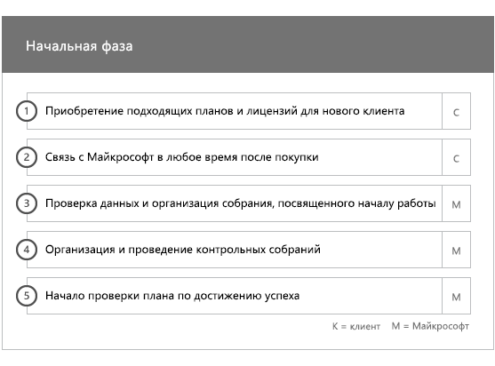
  
## Фаза оценкиAssess phase

Your FastTrack Manager conducts an interactive success planning call with you and your adoption team.Your FastTrack Manager conducts an interactive success planning call with you and your adoption team. This introduces you to the capabilities of the eligible services you purchased, the key foundations you need for success, the methodology for driving usage of the service, and scenarios you can use to get value from the services.This introduces you to the capabilities of the eligible services you purchased, the key foundations you need for success, the methodology for driving usage of the service, and scenarios you can use to get value from the services. We assist you in success planning and provide feedback on key areas (as needed).We assist you in success planning and provide feedback on key areas (as needed).
  
Специалисты FastTrack вместе с вами оценят исходную среду и требования.FastTrack Specialists work with you to assess your source environment and the requirements. Мы предоставляем средства для сбора данных о среде и пошаговой оценки требований к пропускной способности и оценки Интернет-браузеров, операционных систем, системы доменных имен (DNS), сети, инфраструктуры и системы удостоверений, чтобы определить, требуются ли какие-либо изменения для входящей миграции.We provide tools for you to gather data about your environment and guide you through estimating bandwidth requirements and assessing your internet browsers, client operating systems, Domain Name System (DNS), network, infrastructure, and identity system to determine if any changes are required for onboarding. 
  
Based on your current setup, we provide a remediation plan that brings your source environment up to the minimum requirements for successful onboarding to Office 365 and, if needed, for successful mailbox and/or data migration.Based on your current setup, we provide a remediation plan that brings your source environment up to the minimum requirements for successful onboarding to Office 365 and, if needed, for successful mailbox and/or data migration. We provide a set of suggested activities to increase end user value and adoption.We provide a set of suggested activities to increase end user value and adoption. We also set up appropriate checkpoint calls for the Remediate phase.We also set up appropriate checkpoint calls for the Remediate phase.
  
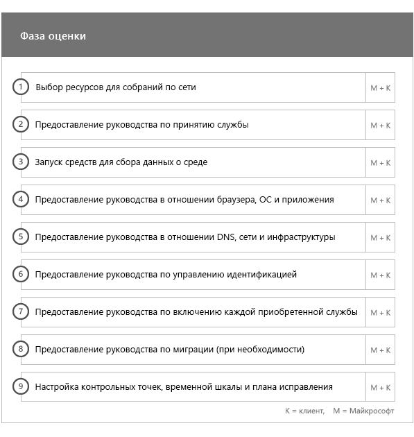
  
## Фаза исправленияRemediate phase

Задачи устранения ошибок выполняются в соответствии с исходной средой, чтобы обеспечить соответствие требованиям для входящей миграции, внедрения и переноса каждой службы надлежащим образом.You do the remediation tasks based on your source environment so that you meet the requirements for onboarding, adopting, and migrating each service as needed.
  

  
We also provide a set of suggested activities to increase end user value and adoption.We also provide a set of suggested activities to increase end user value and adoption. Before beginning the Enable phase, we jointly verify the outcomes of the remediation activities to make sure you're ready to proceed.Before beginning the Enable phase, we jointly verify the outcomes of the remediation activities to make sure you're ready to proceed. 
  
На этом этапе закрепленный за вами менеджер FastTrack поможет выполнить планирование. Он посоветует необходимые ресурсы и даст рекомендации, ознакомившись с которыми, вы сможете сделать службу доступной для вашей организации и обеспечить ее принятие пользователями.During this phase, your FastTrack Manager works with you on success planning, guiding you to the right resources and best practices to provide guidance for you to make the service available to your organization and drive usage across the services.
  
## Фаза включенияEnable phase

После выполнения всех действий по устранению ошибок внимание переключается на настройку основной инфраструктуры для использования служб, подготовку Office 365: и проведение мероприятий по внедрению служб.When all remediation activities are complete, the focus shifts to configuring the core infrastructure for service consumption, provisioning Office 365, and conducting the activities to drive service adoption. 
  
## Базовое подключениеCore

Core onboarding involves service provisioning and tenant and identity integration.Core onboarding involves service provisioning and tenant and identity integration. It also includes steps for providing a foundation for onboarding services like Exchange Online, SharePoint Online, and Skype for Business Online.It also includes steps for providing a foundation for onboarding services like Exchange Online, SharePoint Online, and Skype for Business Online. You and your FastTrack Manager continue to have success planning checkpoint meetings to evaluate progress against your goals and determine what further assistance you need.You and your FastTrack Manager continue to have success planning checkpoint meetings to evaluate progress against your goals and determine what further assistance you need.
  
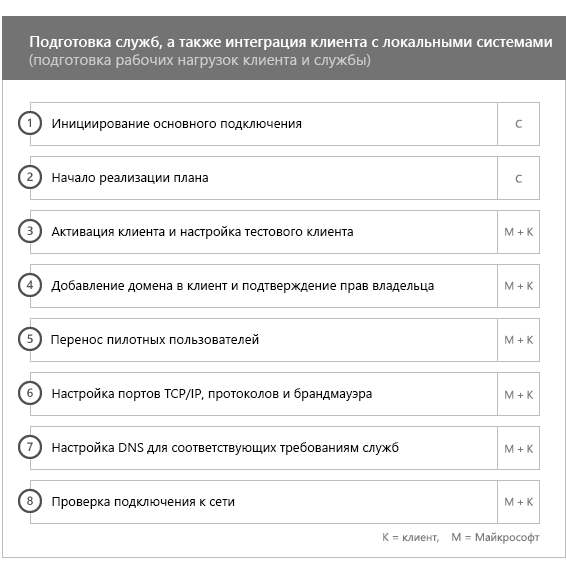
  
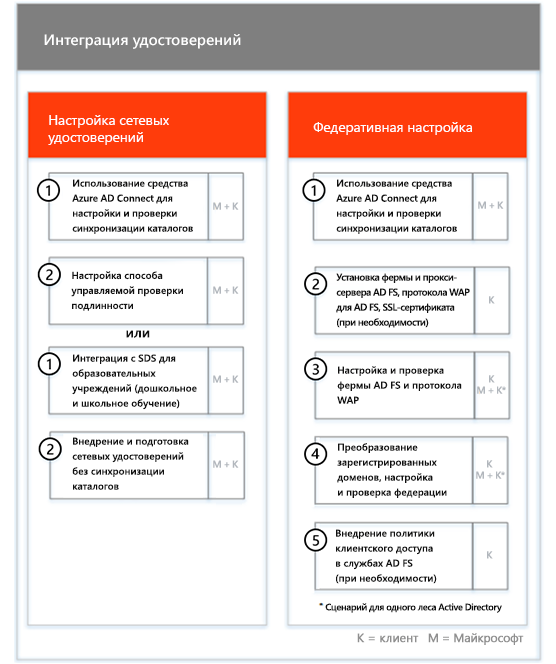
  
> [!NOTE]
> WAP stands for Web Application Proxy.WAP stands for Web Application Proxy. SSL stands for Secure Sockets Layer.SSL stands for Secure Sockets Layer. SDS stands for School Data Sync. For more information on SDS, see [Welcome to Microsoft School Data Sync](https://go.microsoft.com/fwlink/?linkid=871480).SDS stands for School Data Sync. For more information on SDS, see [Welcome to Microsoft School Data Sync](https://go.microsoft.com/fwlink/?linkid=871480). 
  
Подключение одной или нескольких поддерживаемых служб можно начать после завершения базового подключения.Onboarding for one or more eligible services can begin once core onboarding is finished.
  
## Exchange OnlineExchange Online

For Exchange Online, we guide you through the process to get your organization ready to use email.For Exchange Online, we guide you through the process to get your organization ready to use email. The exact steps, depending on your source environment and your email migration plans, can include providing guidance for:The exact steps, depending on your source environment and your email migration plans, can include providing guidance for:
  
- Настройка функций Exchange Online Protection (EOP) для всех доменов, поддерживающих почту и проверенных в Office 365.Setting up Exchange Online Protection (EOP) features for all mail-enabled domains validated in Office 365.   
    > [!NOTE]
    > Записи обмена электронной почтой (MX) должны указывать на Office 365.Your mail exchange (MX) records must point to Office 365.   
- Setting up the Exchange Online Advanced Threat Protection (ATP) feature if it's part of your subscription service once your MX records point to Office 365.Setting up the Exchange Online Advanced Threat Protection (ATP) feature if it's part of your subscription service once your MX records point to Office 365. This feature is configured as part of the Exchange Online Protection antimalware settings.This feature is configured as part of the Exchange Online Protection antimalware settings.   
- Настройка портов брандмауэра.Configuring firewall ports.   
- Настройка DNS, в том числе обязательного автообнаружения, инфраструктуры политики отправителей и записей MX (при необходимости).Setting up DNS, including the required Autodiscover, sender policy framework (SPF), and MX records (as needed).     
- Настройка потока обработки почты между исходной средой обмена сообщениями и Exchange Online (при необходимости).Setting up email flow between your source messaging environment and Exchange Online (as needed).   
- Перенос почты из исходной среды обмена сообщениями в Office 365.Undertaking mail migration from your source messaging environment to Office 365.   
    > [!NOTE]
    > Дополнительные сведения о переносе почты и данных см. в статье [Перенос данных](O365-data-migration.md).For more information on mail and data migration, see [Data Migration](O365-data-migration.md). 
  
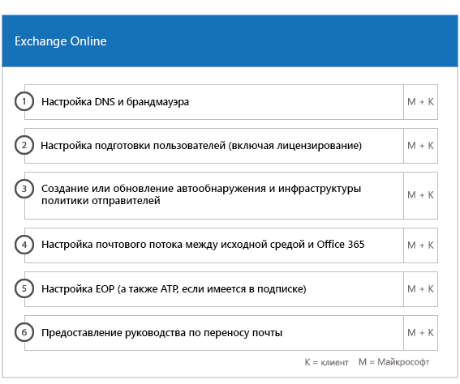
  
## SharePoint Online и OneDrive для бизнесаSharePoint Online and OneDrive for Business

Мы предоставляем руководство по следующим вопросам:For SharePoint Online and OneDrive for Business, we provide guidance for: 
- Настройка DNS.Setting up DNS.   
- Настройка портов брандмауэра.Configuring firewall ports.   
- Подготовка пользователей и лицензий.Provisioning users and licenses.   
- Настройка функций гибридной среды SharePoint, таких как гибридный поиск, гибридные сайты, гибридная таксономия, типы контента, гибридная функция самостоятельного создания сайтов (только для SharePoint Server 2013), расширенное средство запуска приложений, гибридная служба OneDrive для бизнеса и сайты экстрасети.Configuring SharePoint hybrid features, like hybrid search, hybrid sites, hybrid taxonomy, content types, hybrid self-service site creation (SharePoint Server 2013 only), extended app launcher, hybrid OneDrive for Business, and extranet sites.
    
Специалисты FastTrack предоставляют необходимые инструменты и документацию по переносу данных в Office 365, а также выполняют настройку в случаях, когда это возможно и целесообразно.FastTrack Specialists provide guidance on data migration to Office 365 by using a combination of tools and documentation and by performing configuration tasks where applicable and feasible.
  
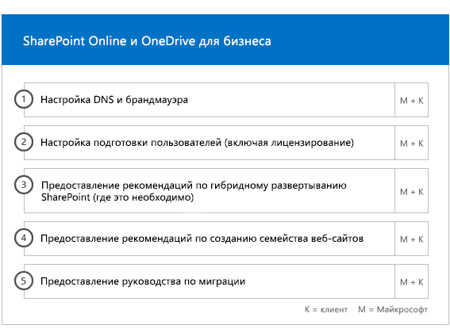
  
## OneDrive для бизнесаOneDrive for Business

Этапы подключения OneDrive для бизнеса зависят от того, используете ли вы SharePoint, и (если это так) от используемой версии.For OneDrive for Business, the steps depend on if you're currently using SharePoint, and if so, which version. 
  
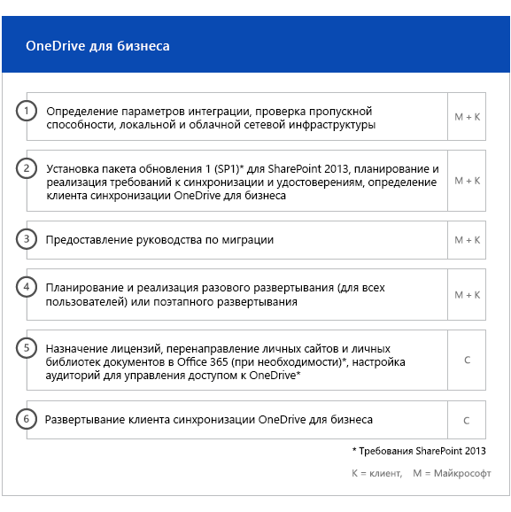
  
## Skype для бизнеса OnlineSkype for Business Online

Мы предоставляем руководство по следующим вопросам:For Skype for Business Online, we provide guidance for: 
- Настройка портов брандмауэра.Configuring firewall ports.    
- Настройка DNS.Setting up DNS.    
- Создание учетных записей для устройств системы комнат.Creating accounts for any room system devices.    
- Развертывание поддерживаемого клиента Skype для бизнеса Online.Deploying a supported Skype for Business Online client.   
- Установка конфигурации разделенного домена между локальной средой Lync 2010, Lync 2013 или Skype для бизнеса 2015 и клиентом Skype для бизнеса Online (если это необходимо).Establishing split domain server configuration between your on-premises Lync 2010, Lync 2013, or Skype for Business 2015 server environment and Skype for Business Online tenant (if applicable).
- Включение планов звонков, вещания собраний Skype и телефонной системы и планов звонков (на доступных рынках — недоступно в планах GCC High или DoD).Enabling Calling Plans, Skype Meeting Broadcast, and Phone System and Calling Plans (in available markets – not available in GCC High or DoD plans). 
    
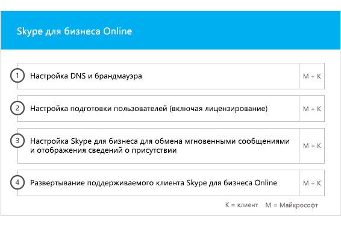
  
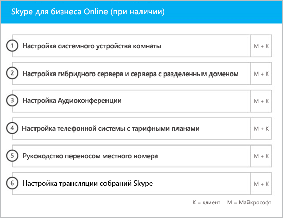
  
## Microsoft TeamsMicrosoft Teams

> [!NOTE]
> Следующее недоступно в планах GCC High или DoD.The following isn't available in GCC High or DoD plans.

Мы предоставляем руководство по следующим вопросам:For Microsoft Teams, we provide guidance for: 
- Проверка минимальных требований.Confirming minimum requirements.   
- Настройка портов брандмауэра.Configuring firewall ports.   
- Настройка DNS.Setting up DNS.  
- Подтверждение того, что рабочее пространство Microsoft Teams включено в клиенте Office 365.Confirming Microsoft Teams is enabled on your Office 365 tenant.    
- Включение или отключение пользовательских лицензий.Enabling or disabling user licenses.
    
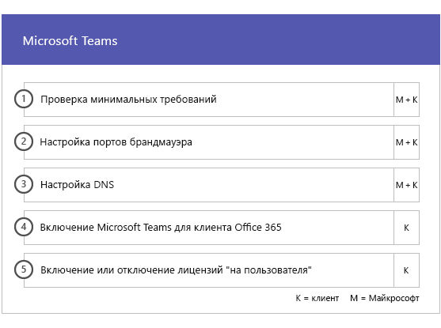
  
## Power BIPower BI

Мы предоставляем руководство по следующим вопросам:For Power BI, we provide guidance for:  
- Назначение лицензий на Power BI.Assigning Power BI licenses.    
- Развертывание приложения Power BI Desktop.Deploying the Power BI Desktop app.   
## Project OnlineProject Online

Мы предоставляем руководство по следующим вопросам:For Project Online, we provide guidance for: 
- Проверка основных функций SharePoint, необходимых для работы Project Online.Verifying basic SharePoint functionality that Project Online relies on.    
- Добавление службы Project Online в клиент (в том числе добавление подписок для пользователей).Adding the Project Online service to your tenant (including adding subscriptions to users).    
- Настройка пула корпоративных ресурсов (ERP).Setting up the Enterprise Resource Pool (ERP).   
- Создание первого проекта.Creating your first project. 
    
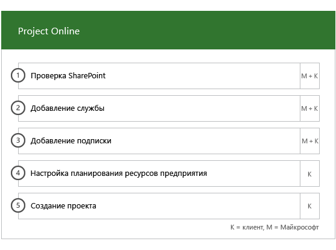
  
## Yammer корпоративныйYammer Enterprise

Мы предоставляем руководство по включению службы Yammer Enterprise.For Yammer, we provide guidance for enabling the Yammer Enterprise service.

> [!NOTE]
> Yammer Enterprise не является компонентом Office 365 США, но его можно бесплатно приобрести в качестве автономного решения для каждого пользователя, лицензированного для Office 365 в GCC.Yammer Enterprise isn't a component of Office 365 US Government but can be acquired at no cost as a standalone offer for each user licensed for Office 365 in GCC. В настоящее время это предлагается только тем пользователям, которые приобрели Office 365 GCC в соответствии с корпоративными соглашениями и соглашениями о корпоративном подписке.This offer is currently limited to customers that purchase Office 365 GCC under Enterprise Agreements and Enterprise Subscription Agreements. Yammer недоступна в планах GCC High или DoD.Yammer isn't available in GCC High or DoD plans. 
  
## Приложения Microsoft 365Microsoft 365 Apps

Мы предоставляем руководство по следующим вопросам:For Microsoft 365 Apps, we provide guidance for: 
- Решение проблем, связанных с развертыванием.Addressing deployment issues.    
- Назначение пользователям лицензий с помощью [Центра администрирования Microsoft 365](https://go.microsoft.com/fwlink/?linkid=2032704) и Windows PowerShell.Assigning end-user licenses using the [Microsoft 365 admin center](https://go.microsoft.com/fwlink/?linkid=2032704) and Windows PowerShell.    
- Установка приложений Microsoft 365 с портала Office 365 с помощью технологии "нажми и работай".Installing Microsoft 365 Apps from the Office 365 portal using Click-to-Run.    
- Установка приложений Office Mobile (например, Outlook Mobile, Word Mobile, Excel Mobile и PowerPoint Mobile) на устройствах с iOS или Android.Installing Office Mobile apps (like Outlook Mobile, Word Mobile, Excel Mobile, and PowerPoint Mobile) on your iOS or Android devices.   
- Настройка параметров обновления с помощью средства развертывания Office 365.Configuring update settings using the Office 365 Deployment Tool.    
- Настройка одного сервера распространения на месте для приложений Microsoft 365, в том числе помощь по созданию файла configuration.xml для использования в средстве развертывания Office 365.Setting up a single on-site distribution server for Microsoft 365 Apps, including assistance with the creation of a configuration.xml file for use with the Office 365 Deployment Tool.    
- Развертывание с помощью Microsoft Endpoint Configuration Manager, а также создание пакета Microsoft Endpoint Configuration Manager.Deployment using Microsoft Endpoint Configuration Manager, including assistance with the creation of Microsoft Endpoint Configuration Manager packaging.
    
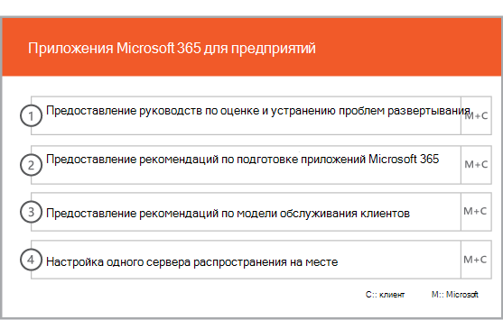
