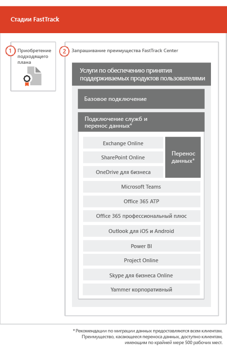

# Процесс FastTrackThe FastTrack Process

Процесс FastTrack предоставляет услуги по подключению и популяризации продукта среди пользователей.The FastTrack process provides onboarding and user adoption services. 
  
Входящая миграция состоит из указанных ниже частей.Onboarding consists of:
  
- *Базовая подключение* — это задачи, необходимые для настройки клиентов и (при необходимости) интеграции с Azure Active Directory. Кроме того, базовое подключение создает основу для подключения других подходящих служб.Core onboarding — These are tasks required for tenant configuration and integration with Azure Active Directory (Azure AD) if needed. Core onboarding also provides the baseline for onboarding other eligible services. 
    
- *Подключение и миграция служб* — задачи подключения служб позволяют реализовывать сценарии в клиенте. Перенос данных (в том числе электронной почты и файлов) рассматривается в разделе [Перенос данных](data-migration.md).*Service onboarding and migration* — Service onboarding tasks enable scenarios in your tenant. Data migration (including email and files) is covered in [Data Migration](data-migration.md). 
    
Услуги по обеспечению принятия продукта пользователями включают задачи с инструкциями по уведомлению пользователей о доступных им службах и о том, как использовать эти службы для повышения эффективности работы. Такая помощь оказывается одновременно с мероприятиями по входящей миграции.User adoption services are comprised of tasks that provide guidance for you to ensure your users are aware of the eligible services and can use them to drive business value. This assistance occurs in parallel to onboarding activities.
  
> [!NOTE]
> Специалисты FastTrack предоставляют пользователям рекомендации и советы для достижения быстрых и предсказуемых результатов. Если вы выполните развертывание без учета этих рекомендаций, это может сказаться на эффективности подключения и удобстве использования службы. Руководство включает в себя как устные, так и письменные инструкции. Когда специалисты FastTrack предоставляют руководство, они не могут действовать от вашего имени. Пока ваша подписка активна, вы можете с помощью FastTrack подключить любой продукт, соответствующий критериям, и обеспечить его принятие.FastTrack provides customers with a recommended approach, guidance, and best practices engineered to deliver quick and predictable outcomes. If you choose to deploy outside of this guidance, your onboarding experience and usage of the service may be impacted. Guidance is defined as a combination of verbal and written assistance. When FastTrack Specialists provide guidance, FastTrack personnel cannot act on your behalf. You can use FastTrack services to onboard and adopt any qualifying product workload as long as your subscription is current. 
  
## Процесс входящей миграцииThe onboarding process

На приведенной ниже схеме представлен процесс подключения.The following diagram illustrates the onboarding process.
  

  
- Вы можете получить помощь через Центр администрирования Office 365: или [сайт FastTrack](https://go.microsoft.com/fwlink/?linkid=780698). Чтобы получить помощь через Центр администрирования Office 365:, администратор должен войти в Центр администрирования и клацнуть мини-приложение **Нужна помощь?** Чтобы получить помощь через [сайт FastTrack](https://go.microsoft.com/fwlink/?linkid=780698), выполните вход, нажмите **Службы** и заполните форму **Request Assistance for Office 365**.You can get help through the Office 365 admin center or the [FastTrack site](https://go.microsoft.com/fwlink/?linkid=780698). To get help through the Office 365 admin center, your admin signs into the admin center and then clicks the **Need help?** widget. To get help through the [FastTrack site](https://go.microsoft.com/fwlink/?linkid=780698), sign in, click **Services**, and complete the **Request Assistance for Office 365** form. 
    
    > [!NOTE]
    >  Если в клиенте Office 365 указан партнер, эта команда не будет отображаться. Для получения помощи обратитесь к партнеру.If you have a partner listed in your Office 365 tenant, you won't see this option. Please consult your partner for assistance. 
  
    Вы также можете запросить помощь на [сайте FastTrack](https://go.microsoft.com/fwlink/?linkid=780698) в списке доступных для вашего клиента услуг.You can also ask for FastTrack Center help from the [FastTrack site](https://go.microsoft.com/fwlink/?linkid=780698) in the list of available services for your tenant. 
    
    Когда начнется поддержка входящей миграции, мы составим расписание собраний по сети.Once onboarding assistance starts, we set up a schedule of online meetings.
    
- Партнеры можно также получить помощь через [сайт FastTrack](https://go.microsoft.com/fwlink/?linkid=780698) от лица клиента. Для этого партнер должен войти на сайт, выбрать клиента, нажать **Службы** и заполнить форму **Request Assistance for Office 365**.Partners can also get help through the [FastTrack site](https://go.microsoft.com/fwlink/?linkid=780698) on behalf of a customer. To do so, the partner signs in to the site, selects the customer record, clicks **Services**, and completes the **Request Assistance for Office 365** form. 
    
- Специалисты FastTrack предоставляют руководство по выполнению базового подключения и подключения служб, а также по планированию успешного принятия пользователями подходящих служб.The FastTrack team provides guidance with core and service onboarding and planning successful adoption of eligible services.
    
- Специалисты FastTrack в удаленном режиме предоставляют необходимую помощь по обеспечению подключения, миграции, а также принятия пользователями.FastTrack Specialists provide all onboarding, migration, and user adoption services remotely.
    
- Специалисты FastTrack оказывают удаленную поддержку, предоставляя инструменты и опубликованную документацию.FastTrack Specialists assist you remotely by using a combination of tools and published documentation.
    
- Поддержку осуществляет FastTrack Center. Она доступна в обычное рабочее время для соответствующего региона.The FastTrack Center provides assistance and is available during normal business hours for a given region.
    
- Поддержка доступна на английском, вьетнамском, испанском, итальянском, китайском (традиционное письмо), китайском (упрощенное письмо) (сотрудники разговаривают только на мандаринском диалекте китайского языка), корейском, немецком, португальском (Бразилия), тайском, французском и японском языках.Assistance is available in Traditional Chinese and Simplified Chinese (resources speak Mandarin only), English, French, German, Italian, Japanese, Korean, Portuguese (Brazil), Spanish, Thai, and Vietnamese.
    
-  Специалисты FastTrack могут работать непосредственно с вами или вашим представителем.FastTrack Specialists can work directly with you or your representative. 
    
- Специалисты FastTrack предоставляют руководство по переносу электронной почты и данных.FastTrack Specialists provide email and data migration guidance.
    

  

